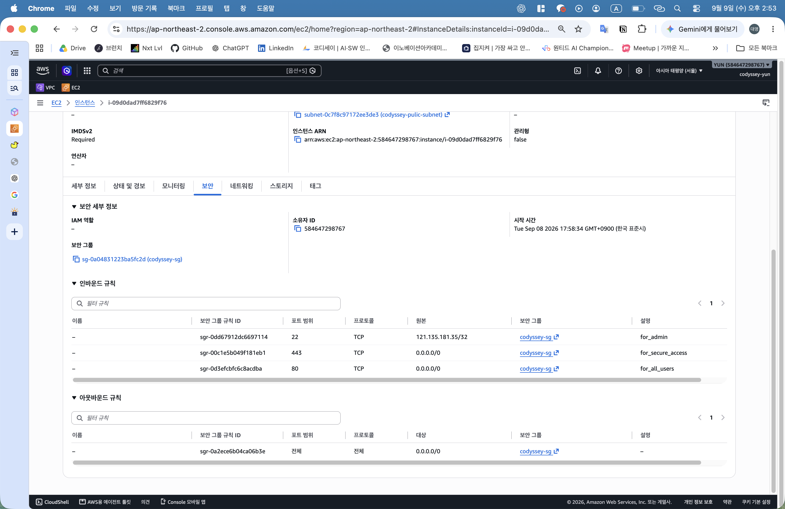

# 최종 설정 추가 확인

- 확인일: 2026-09-09

## EC2 보안·네트워크 연결

EC2 보안 확인 — 이미지 보기

- IAM 인스턴스 역할: 미지정

## EC2 상세 설정

EC2 상세 확인 — 이미지 보기

- 실제 AMI: `ami-0bc151a94289adb52`
- 종료 방지: 비활성

## EBS 연결

EBS 연결 확인 — 이미지 보기

- 장치: `/dev/sda1`, 상태: 사용 중·연결됨
- 하단 오류: `cloudwatch:GetMetricData` 권한 부재에 따른 모니터링 그래프 조회 실패, 볼륨 연결 실패와 구분
- 그래프 조회 권한은 과제 비필수로 추가하지 않기로 결정

## IAM 사용자 확인

IAM 사용자 확인 — 이미지 보기

IAM 사용자 `codyssey-yun` 1명, 소속 그룹 0개 확인

## 관련 문서

- [기본 구축 과정](../01_기본_구축/basic-build-flow.md)
- [HTTP 최종 검증](../04_Docker/docker.md)
- [HTTPS 응답·브라우저 검증](../03_HTTPS/https.md)
- [IAM 최종 정책과 연결 목록](../../configs/README.md)
- [EBS 종료 시 삭제와 리소스 정리 결과](../06_리소스_정리/cleanup-checklist.md)
