# Docker 컨테이너 웹 서비스 배포 기록

## 실행 정보


- 이미지: `nginx:stable-alpine`
- Digest: `nginx@sha256:dc5069ad14f19660b141b21236140b91656bf89bbc3e2417c70ae650cd66104c`
- 컨테이너: `codyssey-web`, `--restart unless-stopped`
- 포트 매핑: 호스트 `80 → 80`, `443 → 443`
- 호스트 Nginx: 중지 및 자동 시작 해제
- 내부 검증: `curl -i http://localhost`의 `200 OK`, `Hello Cloud (Docker)`
- 외부 검증: 퍼블릭 IP `/health`와 HTTPS 도메인 `/health`의 `200 OK`, `OK`

### 최종 실행 명령

EC2의 웹 파일·Nginx 설정·인증서 준비 및 기존 동명 컨테이너 제거 후 실행한 명령

```bash
sudo docker run -d --name codyssey-web --restart unless-stopped \
  -p 80:80 -p 443:443 \
  --mount type=bind,src=/home/ubuntu/codyssey-web,dst=/usr/share/nginx/html,readonly \
  --mount type=bind,src=/home/ubuntu/codyssey-nginx/default.conf,dst=/etc/nginx/conf.d/default.conf,readonly \
  --mount type=bind,src=/etc/letsencrypt,dst=/etc/letsencrypt,readonly \
  nginx:stable-alpine
```

| 옵션 | 의미 |
|---|---|
| `--restart unless-stopped` | 직접 중지한 경우를 제외하고 자동 재시작 |
| `-p 80:80 -p 443:443` | EC2의 HTTP·HTTPS 포트를 컨테이너 포트에 연결 |
| 첫 번째 `--mount` | EC2의 웹 파일을 Nginx 웹 경로에 연결 |
| 두 번째 `--mount` | EC2의 Nginx 설정 파일을 컨테이너에 연결 |
| 세 번째 `--mount` | EC2의 HTTPS 인증서를 컨테이너에 연결 |

[EBS와 Docker 파일 연결 이해](../01_기본_구축/ebs-docker-explained.md) — `--mount` 옵션과 원본 파일 보존 방식 설명

## 설치와 웹 배포 과정


### 10-01 Docker 설치 준비

<details>
<summary>10_01_Docker_설치_준비 — 이미지 보기</summary>

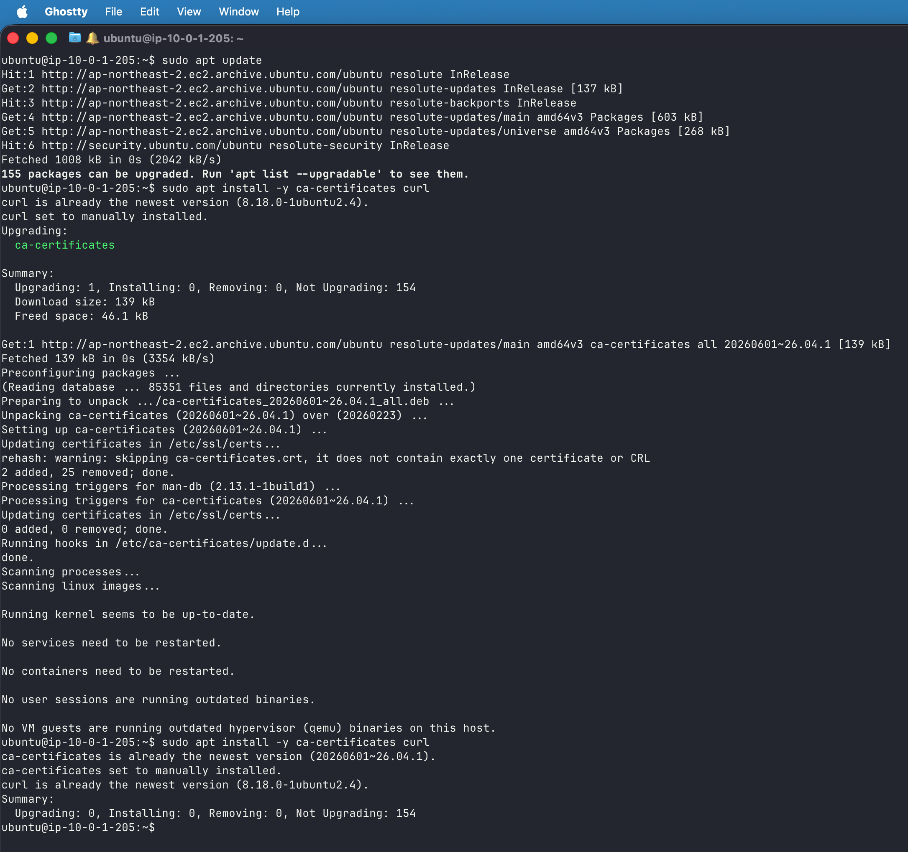

</details>

apt 목록 갱신과 ca-certificates·curl 준비

### 10-02 Docker 저장소 설치

<details>
<summary>10_02_Docker_저장소_설치 — 이미지 보기</summary>

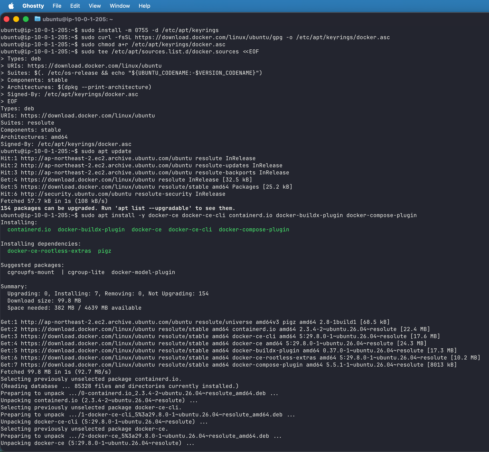

</details>

공식 서명 키·저장소 등록과 Docker 패키지 설치

### 10-03 Docker 서비스

<details>
<summary>10_03_Docker_서비스 — 이미지 보기</summary>

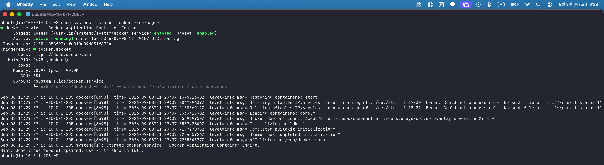

</details>

Docker 서비스 active (running) 확인

### 10-04 Docker hello world

<details>
<summary>10_04_Docker_hello_world — 이미지 보기</summary>

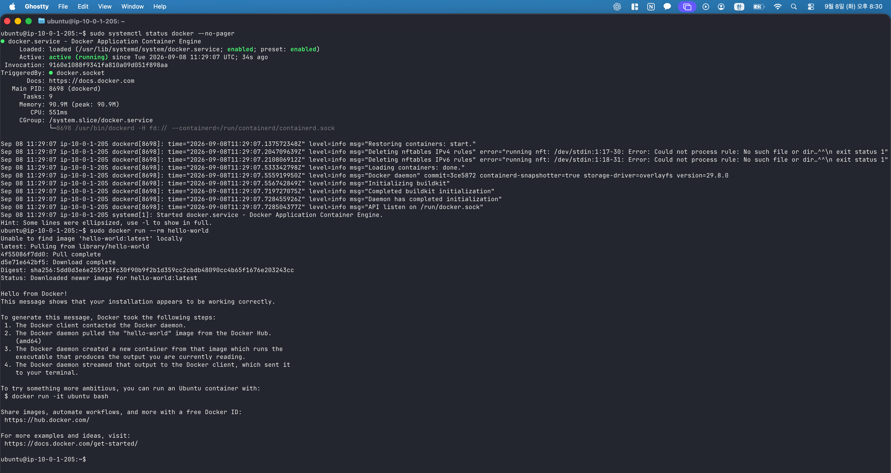

</details>

Hello from Docker 출력으로 컨테이너 실행 검증

### 10-05 Nginx 중지

<details>
<summary>10_05_Nginx_중지 — 이미지 보기</summary>

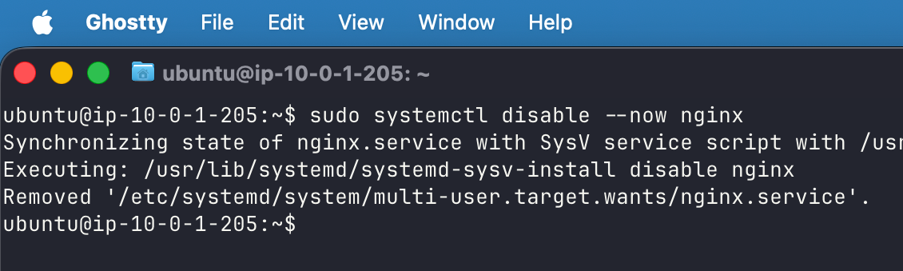

</details>

호스트 Nginx 중지와 자동 시작 해제로 80번 포트 확보

### 10-06 Docker 웹 실행

<details>
<summary>10_06_Docker_웹_실행 — 이미지 보기</summary>

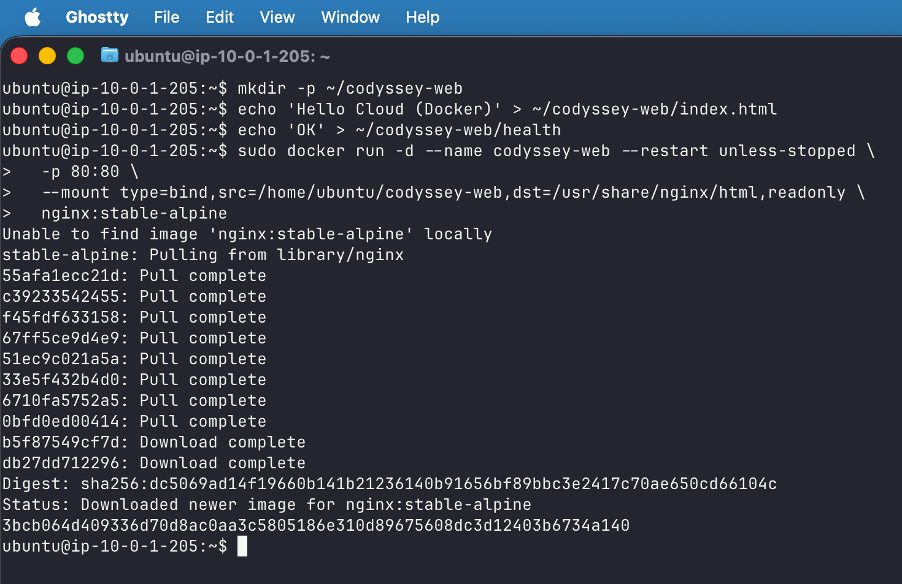

</details>

정적 파일 생성 및 nginx:stable-alpine 이미지의 80:80 실행

### 10-09 Docker 실행 상태와 내부 응답

<details>
<summary>10_09_Docker_내부_health — 이미지 보기</summary>

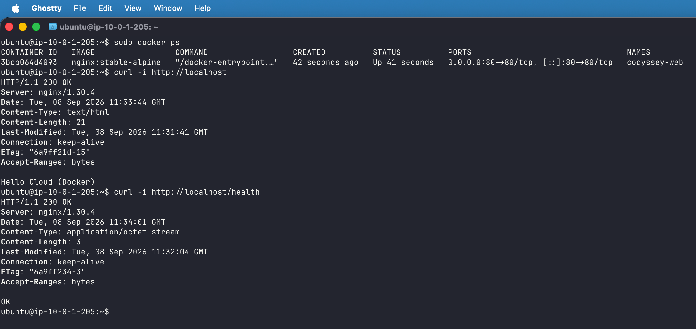

</details>

codyssey-web의 Up 상태 및 80:80 포트 매핑 확인. EC2 localhost의 200·Hello Cloud (Docker)와 localhost/health의 200·OK 확인

### 10-10 Docker 외부 HTTP

<details>
<summary>10_10_Docker_외부_HTTP — 이미지 보기</summary>

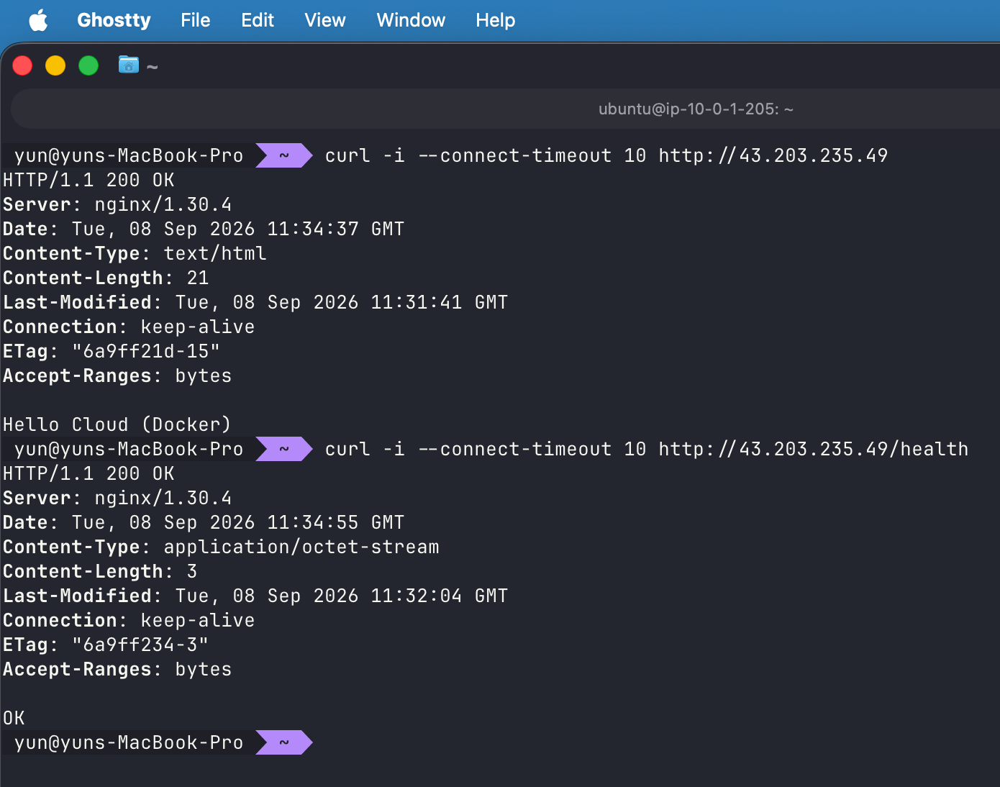

</details>

Mac 외부 메인·health 요청의 200 응답 확인

### 10-11 Docker 브라우저

<details>
<summary>10_11_Docker_브라우저 — 이미지 보기</summary>

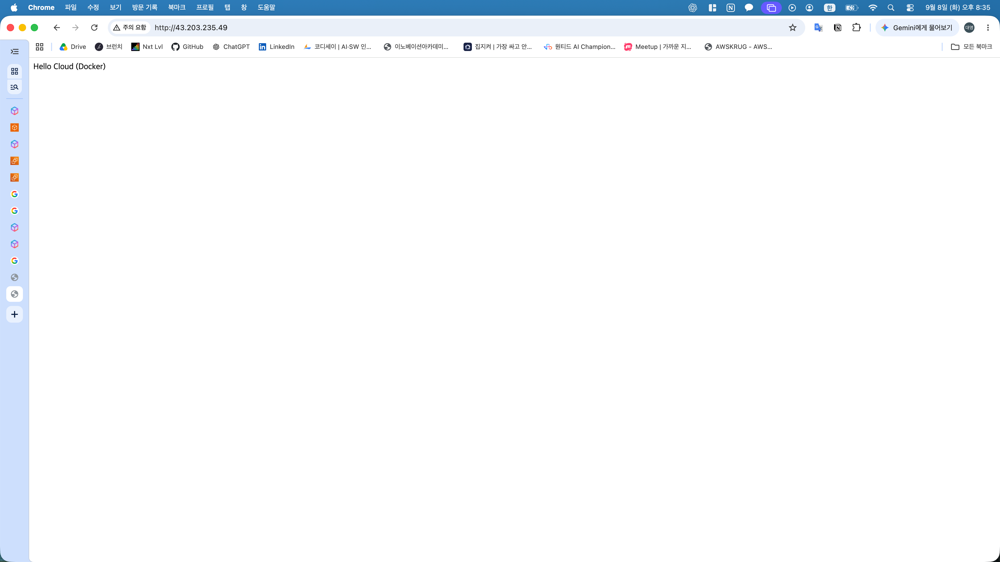

</details>

퍼블릭 IP의 Hello Cloud (Docker) 표시 확인

## HTTPS 적용 후 최종 검증

### 12-05 최종 실행 상태와 내부 HTTP

<details>
<summary>12_05_내부_HTTP_최종 — 이미지 보기</summary>

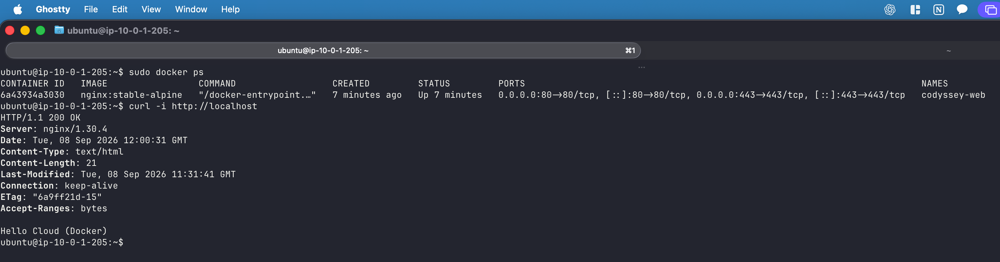

</details>

최종 컨테이너 Up 및 80:80·443:443 포트 매핑 확인. HTTPS 적용 후에도 EC2 localhost의 HTTP 200 유지 확인

### 12-06 외부 HTTP 최종

<details>
<summary>12_06_외부_HTTP_최종 — 이미지 보기</summary>

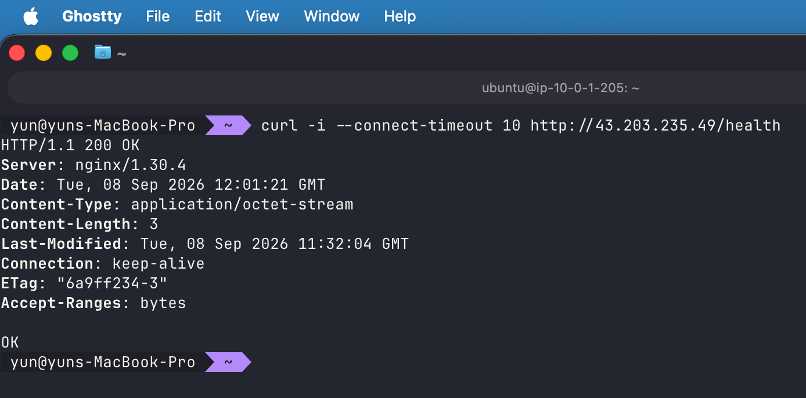

</details>

HTTPS 적용 후에도 퍼블릭 IP health의 HTTP 200 유지 확인

### 12-07 이미지 digest

<details>
<summary>12_07_이미지_digest — 이미지 보기</summary>

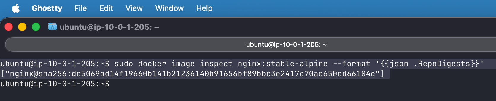

</details>

실행 이미지 RepoDigests 조회 결과 기록
