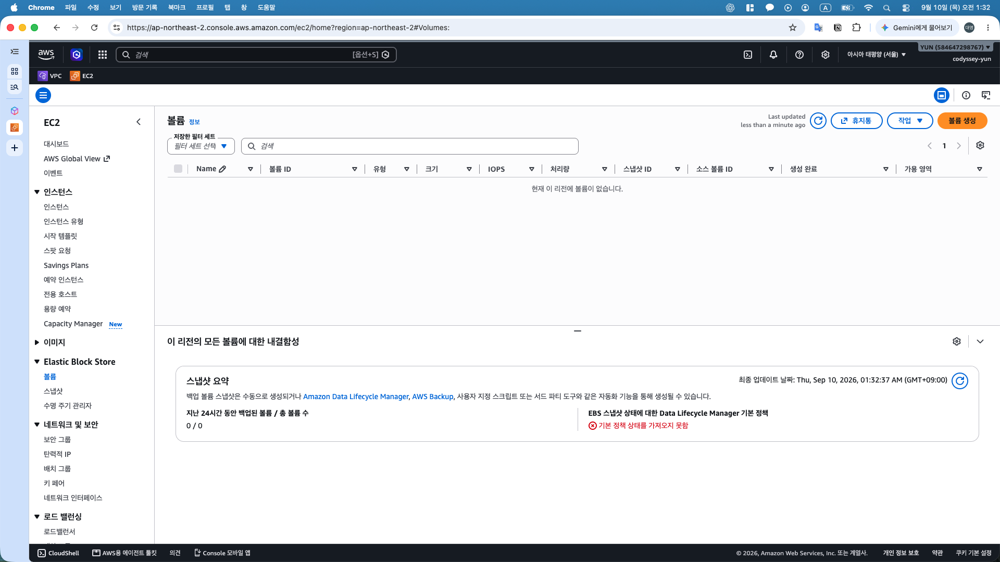
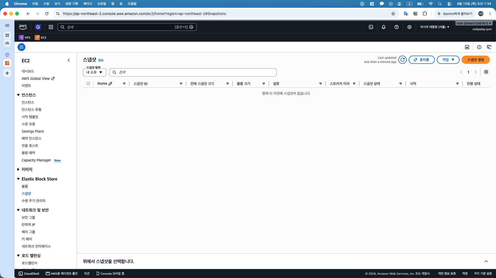
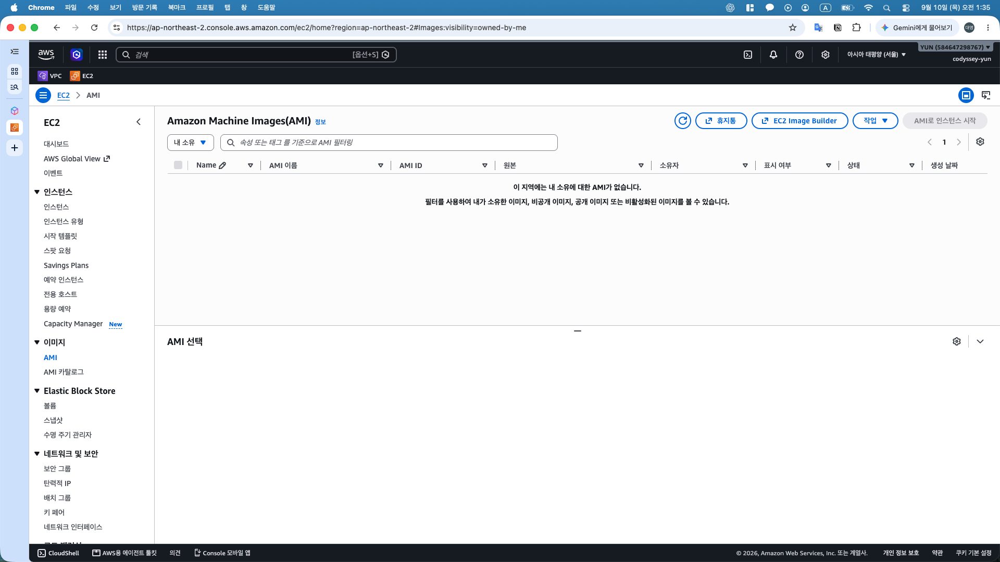
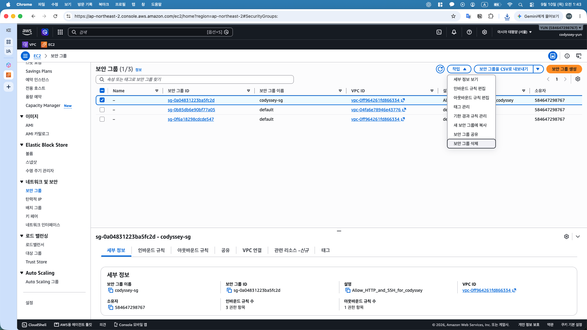
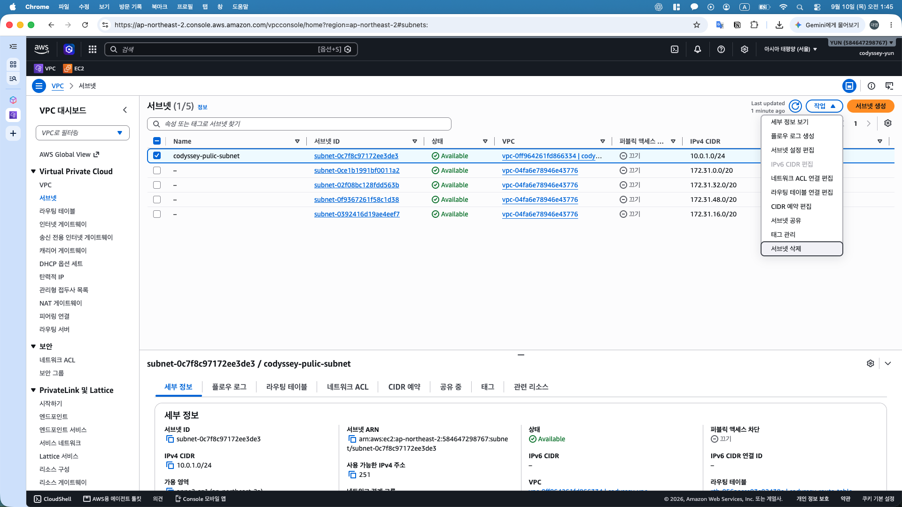
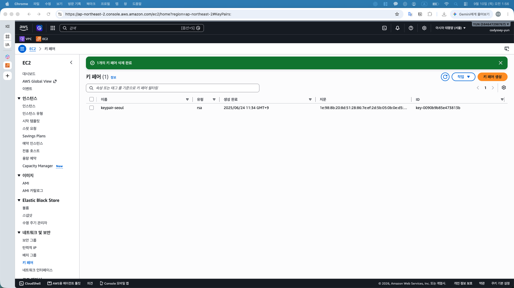

# 리소스 정리 체크리스트

## 1. 자료 확보 및 대상 구분

- [x] HTTP·HTTPS 및 Docker 검증 캡처의 로컬 보관 확인 — 기존 `outputs/09_외부_검증/`, `10_Docker/`, `11_HTTPS/`, `12_최종_검증/` 확인
- [x] 아키텍처 이미지와 실습·트러블 슈팅 문서의 로컬 보관 확인
- [x] 웹 파일, Nginx 설정, 컨테이너 실행 명령 및 갱신 훅의 기록 확인 — [캡처 전사 보관본](../../configs/README.md)
- [x] EC2 인스턴스 ID와 연결된 EBS 볼륨 ID 기록
- [x] 실습 리소스 이름·ID 대조 및 다른 프로젝트 리소스와의 구분

## 2. 대상별 정리 결과

| 대상 | 이름·식별 정보 | 정리 결과 | 증빙 |
|---|---|---|---|
| EC2 | `codyssey-web` / `i-09d0dad7ff6829f76` | 종료 확인 | [종료됨](../../outputs/13_리소스_정리/13_01_EC2_종료.png) |
| EBS | gp3 8 GiB / `vol-0c4938565c0840fd6` | 루트 볼륨 자동 삭제 및 잔여 볼륨 없음 확인 | [전체 볼륨 없음](../../outputs/13_리소스_정리/13_02_EBS_없음.png) |
| Security Group | `codyssey-sg` / `sg-0a04831223ba5fc2d` | 사용자 삭제 완료 확인 | [삭제 대상 선택](../../outputs/13_리소스_정리/13_07_SG_삭제_대상.png) |
| Subnet | `codyssey-pulic-subnet` / `subnet-0c7f8c97172ee3de3` | 사용자 삭제 완료 확인 | [삭제 대상 선택](../../outputs/13_리소스_정리/13_08_서브넷_삭제_대상.png) |
| Route Table | `codyssey-route-table` / `rtb-056aecce93e02438e` | 연결 없음 확인 및 사용자 삭제 완료 확인 | [명시적 연결 0개](../../outputs/13_리소스_정리/13_10_라우팅_연결_해제.png) |
| Internet Gateway | `codyssey-igw` / `igw-0637dc3e8b222c179` | VPC 분리 확인 및 사용자 삭제 완료 확인 | [Detached](../../outputs/13_리소스_정리/13_11_IGW_분리.png) |
| VPC | `codyssey-vpc` / `vpc-0ff964261fd866334` | 사용자 삭제 완료 확인 | [삭제 대상 선택](../../outputs/13_리소스_정리/13_12_VPC_삭제_대상.png) |
| 키페어 | `codyssey-key` | AWS 등록 키 삭제 확인, 로컬 키 정리 사용자 확인 | [삭제 성공 및 목록 제외](../../outputs/13_리소스_정리/13_13_키페어_삭제.png) |
| DuckDNS | `codyssey.duckdns.org` | 등록 삭제 확인 | [삭제 성공 및 도메인 0개](../../outputs/13_리소스_정리/13_14_DuckDNS_삭제.png) |
| IAM 사용자 | `codyssey-yun` | 삭제 확인 | [사용자 삭제 성공 알림](../../outputs/13_리소스_정리/13_15_IAM_사용자_삭제.png) |
| IAM 사용자 지정 정책 | `codyssey-aws-iam` | 연결 없음 확인 및 사용자 삭제 완료 확인 | [정책 사용 대상 없음](../../outputs/13_리소스_정리/13_15_IAM_사용자_삭제.png) |

## 3. 컴퓨트·스토리지 정리

- [x] EC2 `codyssey-web`의 Terminate 실행 및 `Terminated` 상태 확인
- [x] 연결된 EBS 루트 볼륨 자동 삭제 및 서울 리전 잔여 볼륨 없음 확인
- [x] 소유한 EBS 스냅샷·사용자 지정 AMI 없음 확인
- [x] Elastic IP 할당 없음 확인 — Release 대상 없음
- [x] RDS 미생성 사용자 확인 — 추가 데이터베이스·스냅샷 조회 생략

## 4. 네트워크 정리

- [x] 서울 리전 네트워크 인터페이스 없음 확인 — 검색 필터 없는 전체 목록 기준
- [x] `codyssey-sg` 삭제 확인 — 사용자 완료 확인
- [x] `codyssey-pulic-subnet` 삭제 확인 — 사용자 완료 확인
- [x] `codyssey-route-table` 삭제 확인 — 명시적 연결 0개 캡처 및 사용자 완료 확인
- [x] `codyssey-igw`의 VPC 분리 및 삭제 확인 — Detached 캡처 및 사용자 삭제 완료 확인
- [x] `codyssey-vpc` 삭제 확인 — 사용자 완료 확인

## 5. DNS·키페어·IAM 정리

- [x] AWS 키페어 `codyssey-key` 삭제 확인 — 성공 알림 및 목록 제외 확인
- [x] 로컬 `codyssey-key.pem`의 실습 종료 후 정리 — 사용자 확인, 휴지통 이동 안내 기준이며 영구 삭제 여부 미확인
- [x] DuckDNS의 `codyssey.duckdns.org` 등록 삭제 확인 — 성공 알림 및 도메인 0개 확인
- [x] IAM 최종 설정 증빙 확보 및 실습 AWS 리소스 확인 완료 — 기존 IAM 설정 캡처 및 정리 캡처 대조
- [x] 다른 관리 주체의 계정 접근 가능 여부 확인 — 루트 계정 로그인 사용자 확인
- [x] 실습 전용 IAM 사용자 `codyssey-yun` 삭제 확인 — 삭제 성공 알림 확인
- [x] 연결 대상 없는 사용자 지정 정책 `codyssey-aws-iam` 삭제 확인 — 연결 없음 캡처 및 사용자 삭제 완료 확인

## 6. 비용 및 제출 자료 확인

- [x] 실습 리소스 목록의 삭제·해제·미생성 상태 기록 — 캡처와 사용자 완료 확인 근거 구분
- [x] 최초 Billing 비용 확인
- [x] 이미 발생한 비용과 잔여 실습 리소스 여부의 구분 기록
- [x] 본 문서 대상 목록의 결과·증빙 경로 기입
- [x] README 리소스 정리 체크박스 갱신 — 이전 작업에서 반영한 상태 유지

## 7. 정리 과정 및 검증 캡처

### 컴퓨트·스토리지

01. EC2 종료 — 이미지 보기

02. EBS 볼륨 정리 — 이미지 보기

03. 스냅샷 확인 — 이미지 보기

04. AMI 확인 — 이미지 보기

### 네트워크

05. Elastic IP 확인 — 이미지 보기

06. 네트워크 인터페이스 확인 — 이미지 보기

07. 보안 그룹 삭제 대상 — 이미지 보기

08. 서브넷 삭제 대상 — 이미지 보기

09. 라우팅 테이블 삭제 오류 — 이미지 보기

10. 라우팅 테이블 연결 해제 확인 — 이미지 보기

11. 인터넷 게이트웨이 분리 — 이미지 보기

12. VPC 삭제 대상 — 이미지 보기

### 키페어·DNS

13. 키페어 삭제 — 이미지 보기

14. DuckDNS 등록 삭제 — 이미지 보기

### IAM·비용

15. IAM 사용자 삭제 및 정책 정리 대상 — 이미지 보기

16. 최초 비용 확인 — 이미지 보기

