# AWS 웹 서비스 기본 구축 흐름

## 전체 진행 흐름

**리전 선택 → IAM 권한 구성 → VPC·서브넷 생성 → 인터넷 게이트웨이·라우팅 연결 → 보안 그룹·키페어 준비 → EC2 생성 → SSH·외부 통신 확인 → Nginx 배포 → 외부 HTTP 검증**

## 실제 구성 요약

| 구분 | 캡처 기반 구성 |
|---|---|
| 리전 | 서울 `ap-northeast-2` |
| IAM 사용자 / 정책 | `codyssey-yun` / `codyssey-aws-iam` |
| VPC | `codyssey-vpc`, `10.0.0.0/16` |
| 서브넷 | `codyssey-pulic-subnet`, `10.0.1.0/24`, `ap-northeast-2a` |
| 인터넷 게이트웨이 / 라우팅 테이블 | `codyssey-igw` / `codyssey-route-table` |
| 보안 그룹 / 키페어 | `codyssey-sg` / `codyssey-key` |
| EC2 | `codyssey-web`, `t3.micro` 1대, Ubuntu 26.04 LTS |
| 스토리지 | 생성 화면 기준 gp3 8GiB |
| 웹 서버 | 호스트 Nginx 1.28.3 |
| 검증 당시 퍼블릭 IP | `43.203.235.49` |
| 외부 검증 | 메인 페이지 `200 / Hello Cloud`, `/health` `200 / OK` |

> `codyssey-pulic-subnet`의 철자는 실제 화면 기준 표기. 초기 계획의 `b3-1-*` 이름과 Ubuntu 24.04 대신 실제 캡처의 이름과 버전 반영.

## 기본 서비스 요청 흐름

```text
외부 Mac·브라우저
    │ HTTP :80
    ▼
EC2 퍼블릭 IPv4 ↔ Internet Gateway
    │ VPC / Public Subnet의 인터넷 라우팅
    ▼
Security Group — HTTP 80 허용 / SSH 22 내 IP 제한
    ▼
EC2 Ubuntu → 호스트 Nginx → /var/www/html
                              ├─ /       : Hello Cloud
                              └─ /health : OK
```

Docker·HTTPS 적용 후의 상세 과정은 [외부 요청과 응답 흐름](request-flow.md)을 참고한다.

---

## 01. 계정 준비와 리전 선택

실습 리소스의 생성 위치를 서울 리전으로 통일하기 위한 사전 준비

### 01-01 서울 리전 선택

<details>
<summary>서울 리전 선택 — 이미지 보기</summary>

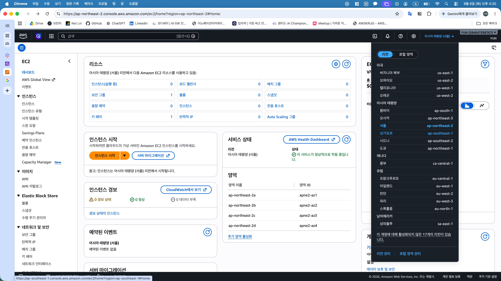

</details>

- **수행 내용:** AWS 콘솔의 리전 메뉴에서 아시아 태평양(서울) 확인
- **확인 포인트:** 실습 대상 리전 `ap-northeast-2` 지정 및 IAM 글로벌 서비스와의 구분

---

## 02. IAM 사용자와 권한 구성

계정 초기 준비 후 별도 IAM 사용자로 전환하기 위한 실습 권한 구성

[IAM 개념과 실습 정책 JSON 이해](iam-policy-explained.md) — 구성 요소·JSON 항목·허용 범위 설명

### 02-01 정책 목록 확인

<details>
<summary>정책 목록 확인 — 이미지 보기</summary>

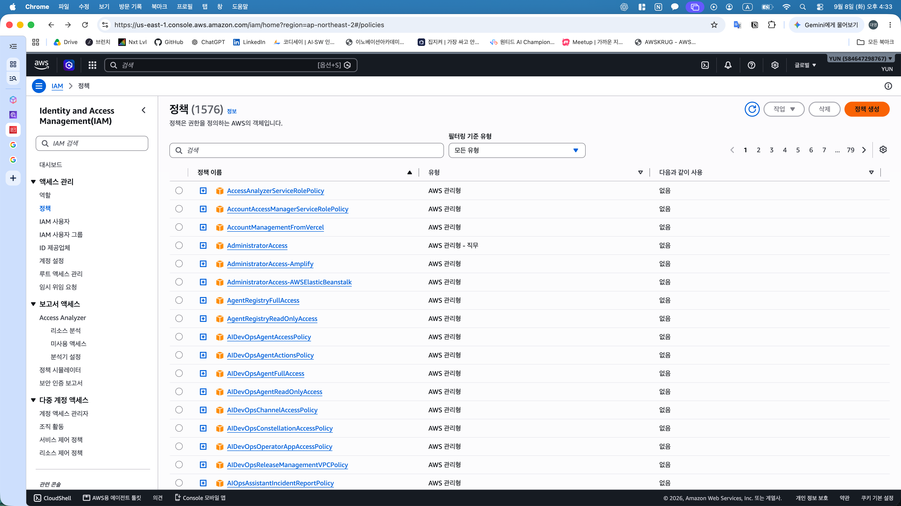

</details>

- **수행 내용:** IAM 정책 목록에서 기존 정책과 사용자 지정 정책 생성 메뉴 확인
- **확인 포인트:** EC2·VPC 실습용 권한 문서 작성 준비

### 02-02 실습 정책 JSON 작성

<details>
<summary>실습 정책 JSON 작성 — 이미지 보기</summary>

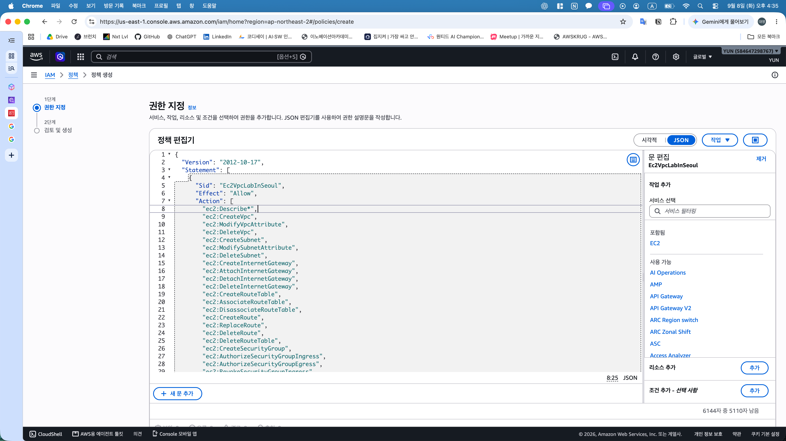

</details>

- **수행 내용:** EC2 조회·VPC 생성·서브넷·인터넷 게이트웨이·라우팅 작업의 Action 구성
- **확인 포인트:** `ec2:Describe*`와 생성·변경·삭제 작업의 명시적 나열

### 02-03 정책 이름과 리전 제한 검토

<details>
<summary>정책 이름과 리전 제한 검토 — 이미지 보기</summary>

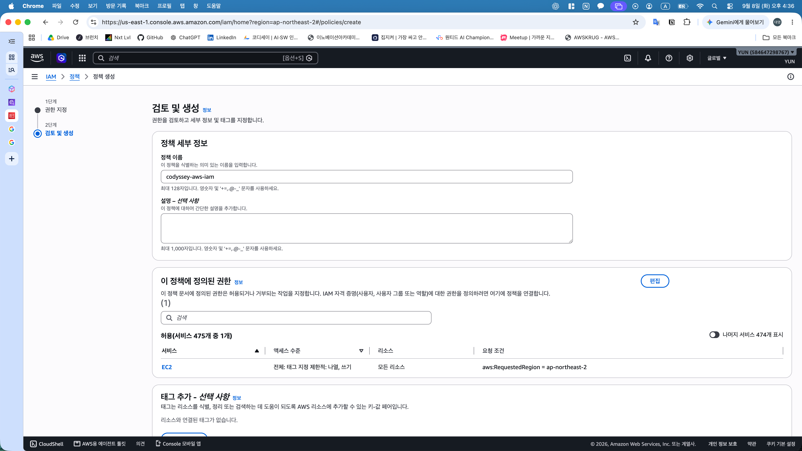

</details>

- **수행 내용:** 정책 이름 `codyssey-aws-iam` 및 요청 조건 `aws:RequestedRegion = ap-northeast-2` 확인
- **확인 포인트:** EC2 서비스·작업·리전 제한 적용, 모든 리소스 대상 권한에 따른 개별 리소스 제한의 한계

### 02-04 실습 사용자 생성 준비

<details>
<summary>실습 사용자 생성 준비 — 이미지 보기</summary>

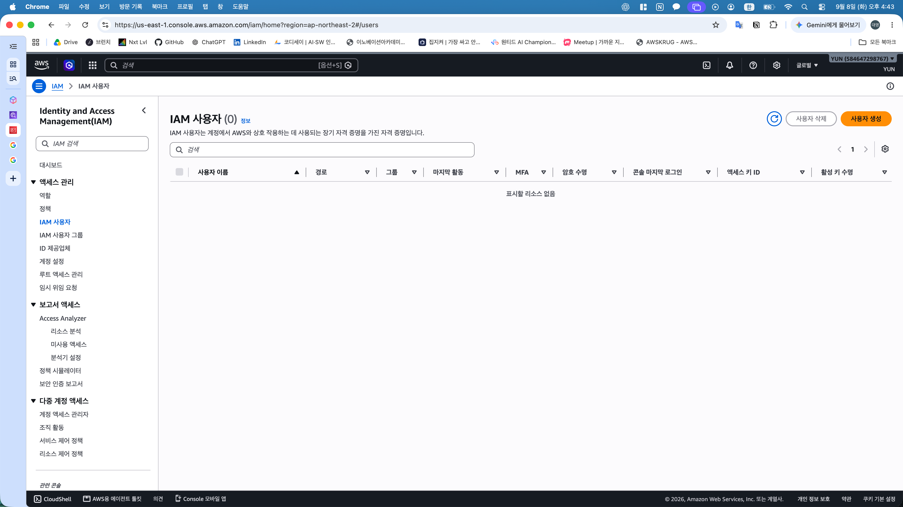

</details>

- **수행 내용:** IAM 사용자 목록과 사용자 생성 메뉴 확인
- **확인 포인트:** 루트 계정의 초기 준비와 본 실습용 사용자 작업의 분리

### 02-05 사용자와 정책 연결 검토

<details>
<summary>사용자와 정책 연결 검토 — 이미지 보기</summary>

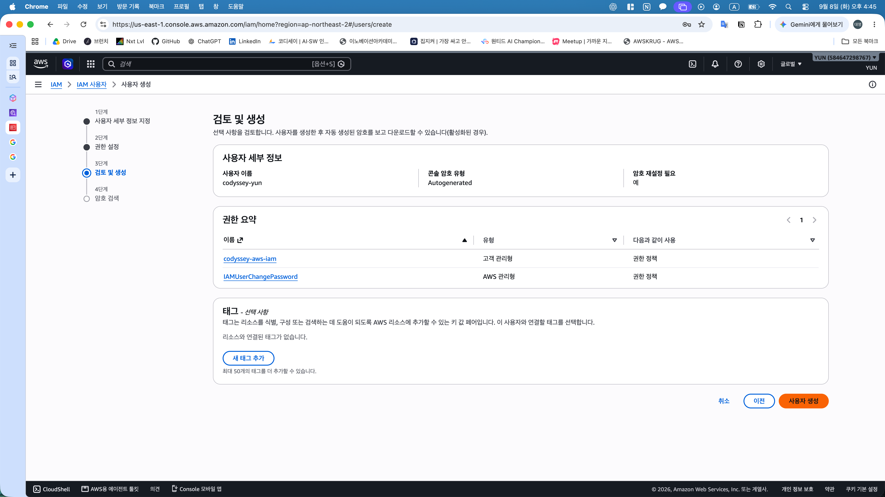

</details>

- **수행 내용:** 사용자 `codyssey-yun`에 `codyssey-aws-iam`과 `IAMUserChangePassword` 연결 검토
- **확인 포인트:** 자동 생성 비밀번호 및 첫 로그인 암호 재설정 설정 확인, 이후 VPC 캡처의 로그인 사용자 전환 확인

---

## 03. VPC와 서브넷 구성

EC2 배치에 앞선 사설 네트워크와 주소 범위 구성

[VPC·서브넷·CIDR 이해](vpc-subnet-explained.md) — 네트워크 구성 관계와 IP 주소 범위 설명

### 03-01 VPC 콘솔 진입

<details>
<summary>VPC 콘솔 진입 — 이미지 보기</summary>

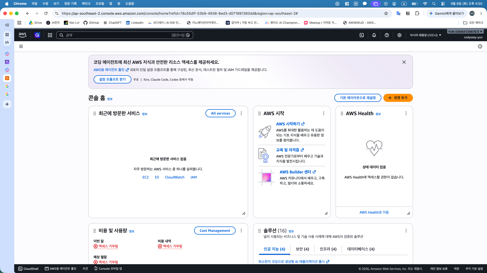

</details>

- **수행 내용:** IAM 사용자로 VPC 콘솔 진입 및 네트워크 생성 메뉴 확인
- **확인 포인트:** 서버 생성 전 VPC·서브넷을 먼저 준비하는 작업 순서

### 03-02 VPC 생성 설정

<details>
<summary>VPC 생성 설정 — 이미지 보기</summary>

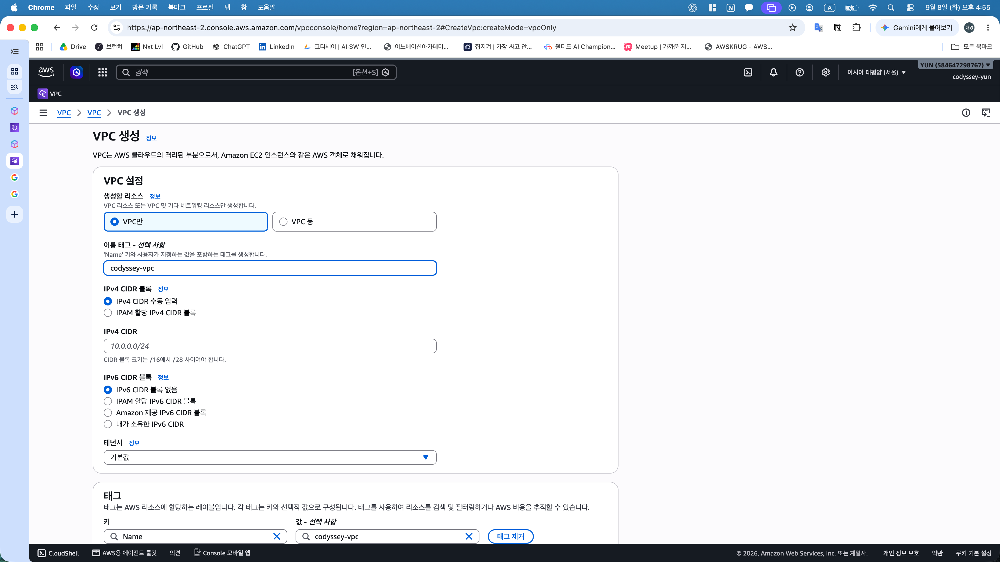

</details>

- **수행 내용:** `VPC만` 생성 방식과 이름 `codyssey-vpc`, IPv6 미사용, 기본 테넌시 선택
- **확인 포인트:** 입력 중 화면의 예시 CIDR과 최종 값 구분, 후속 캡처에서 실제 VPC CIDR `10.0.0.0/16` 확인

### 03-03 서브넷 생성 준비

<details>
<summary>서브넷 생성 준비 — 이미지 보기</summary>

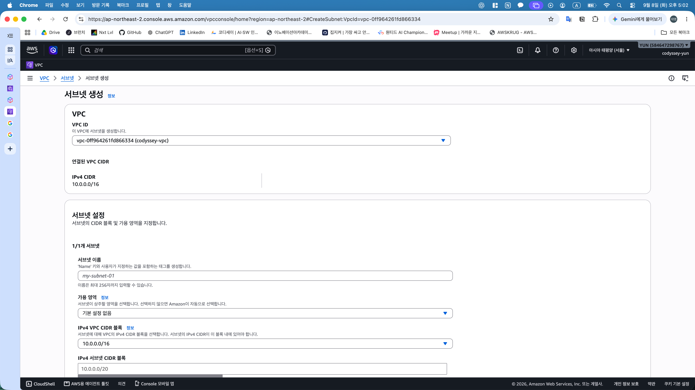

</details>

- **수행 내용:** 생성된 `codyssey-vpc` 및 연결된 VPC CIDR `10.0.0.0/16` 확인
- **확인 포인트:** 입력 전 서브넷 생성 화면 기록, 후속 연결 결과에서 서브넷 CIDR `10.0.1.0/24` 확인

---

## 04. 인터넷 게이트웨이와 라우팅

서브넷의 인터넷 통신을 위한 출구와 목적지별 전달 경로 구성

[라우팅 테이블과 IP 주소 범위 이해](route-table-explained.md) — 역할·CIDR·경로 선택 설명

### 04-01 인터넷 게이트웨이 생성

<details>
<summary>인터넷 게이트웨이 생성 — 이미지 보기</summary>

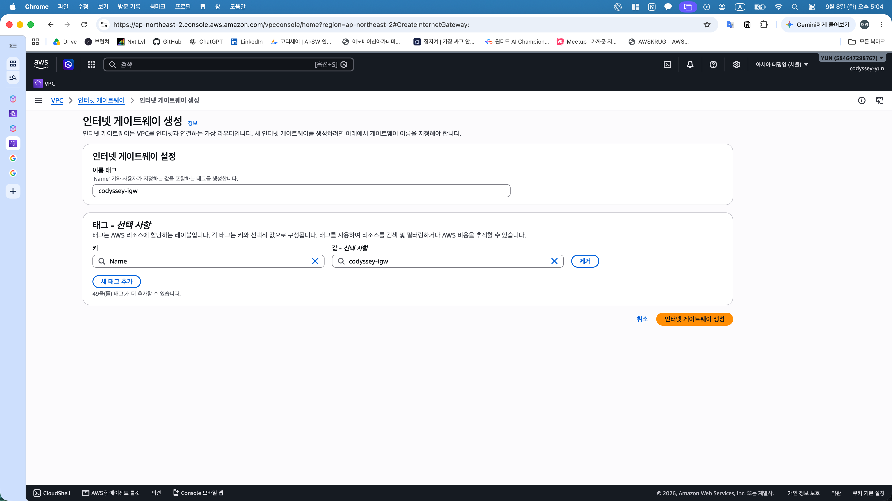

</details>

- **수행 내용:** 이름 `codyssey-igw`와 Name 태그 입력
- **확인 포인트:** VPC와 인터넷 사이의 통신을 위한 게이트웨이 생성 준비

### 04-02 게이트웨이와 VPC 연결

<details>
<summary>게이트웨이와 VPC 연결 — 이미지 보기</summary>

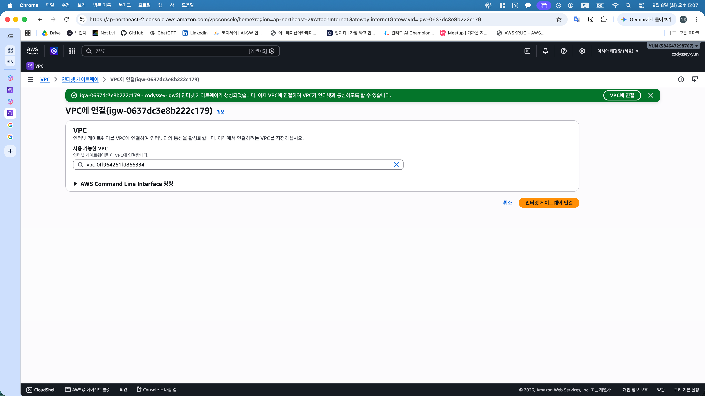

</details>

- **수행 내용:** 인터넷 게이트웨이 생성 성공 알림 및 실습 VPC 선택 확인
- **확인 포인트:** 생성된 게이트웨이를 `codyssey-vpc`에 연결하는 단계

### 04-03 라우팅 테이블 생성

<details>
<summary>라우팅 테이블 생성 — 이미지 보기</summary>

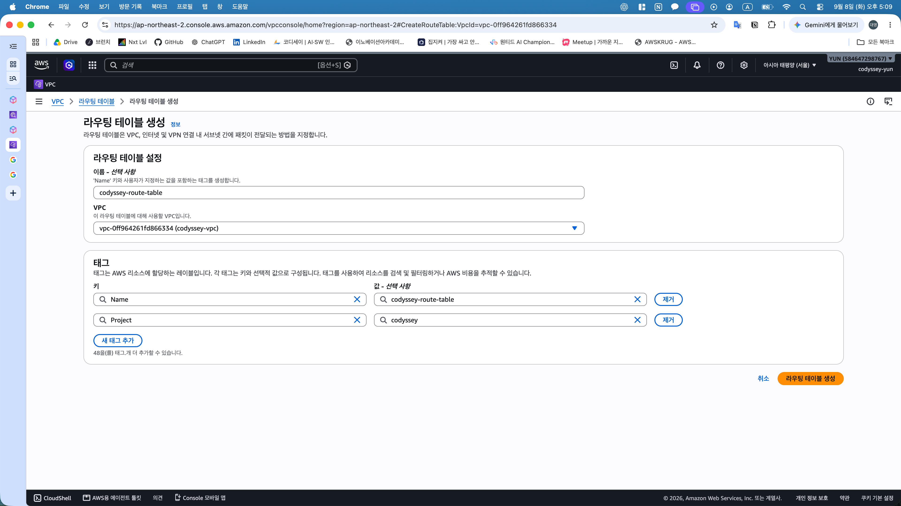

</details>

- **수행 내용:** 사용자 지정 라우팅 테이블 `codyssey-route-table` 생성 설정
- **확인 포인트:** Public Subnet에 적용할 인터넷 경로의 별도 관리

### 04-04 인터넷 기본 경로 추가

<details>
<summary>인터넷 기본 경로 추가 — 이미지 보기</summary>

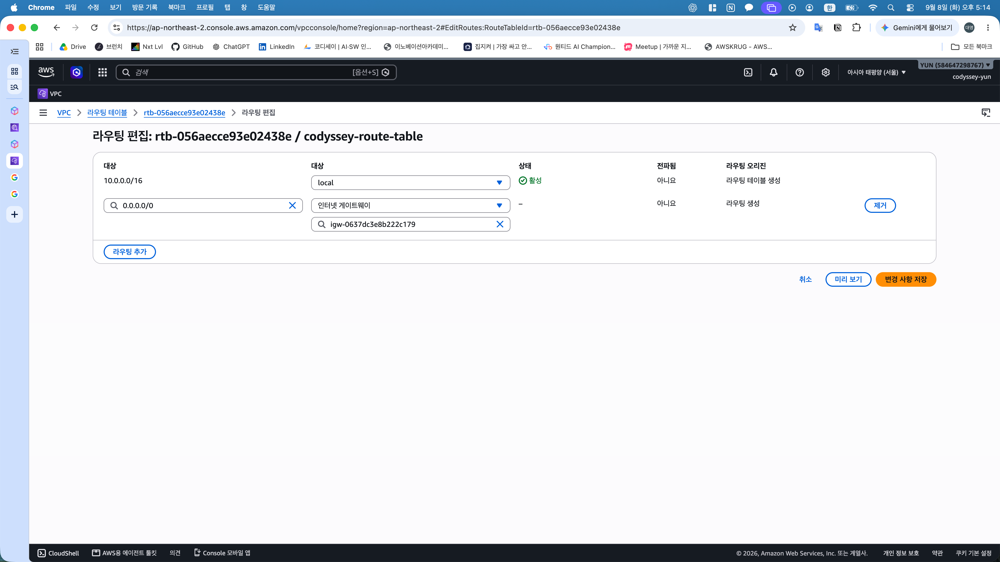

</details>

- **수행 내용:** VPC 내부 경로 `10.0.0.0/16 → local` 유지 및 `0.0.0.0/0 → Internet Gateway` 추가
- **확인 포인트:** VPC 내부 목적지와 외부 목적지에 따른 전달 경로 구분

### 04-05 라우팅 테이블의 서브넷 지정

<details>
<summary>라우팅 테이블의 서브넷 지정 — 이미지 보기</summary>

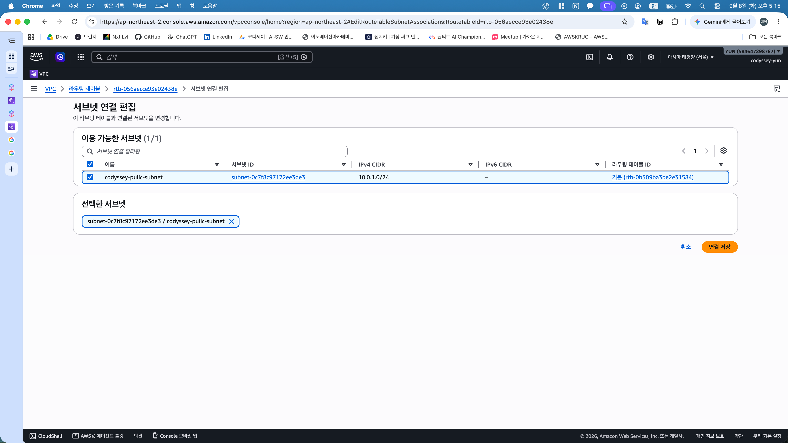

</details>

- **수행 내용:** 서브넷 연결 편집에서 실습 서브넷 선택
- **확인 포인트:** 작성한 라우팅 규칙을 실제 서브넷에 적용하기 위한 명시적 연결

### 04-06 서브넷 연결 결과 확인

<details>
<summary>서브넷 연결 결과 확인 — 이미지 보기</summary>

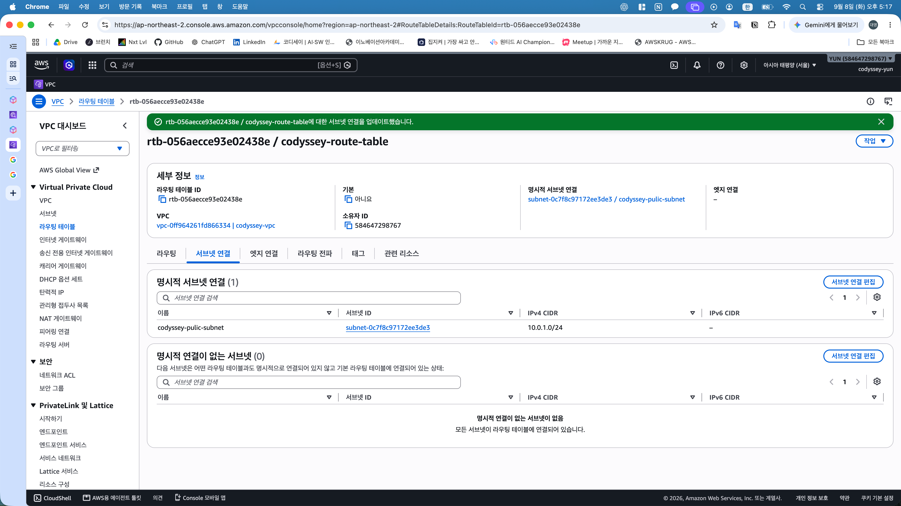

</details>

- **수행 내용:** 연결 성공 알림과 명시적 서브넷 연결 1개 확인
- **확인 포인트:** 실제 이름 `codyssey-pulic-subnet` 및 CIDR `10.0.1.0/24` 확인

---

## 05. 보안 그룹과 SSH 키페어

웹 공개 접속과 서버 관리 접속의 분리 및 SSH 인증 수단 준비

- [인바운드·아웃바운드 규칙 이해](security-group-rules-explained.md) — 통신 방향과 실습 규칙 설명
- [SSH 키페어의 역할과 생성 이유](ssh-key-pair-explained.md) — 공개 키·개인 키와 접속 명령 설명

### 05-01 인바운드 규칙 입력

<details>
<summary>인바운드 규칙 입력 — 이미지 보기</summary>


</details>

- **수행 내용:** `codyssey-sg`에 SSH TCP 22의 내 IP `/32` 제한과 HTTP TCP 80의 `0.0.0.0/0` 허용 입력
- **확인 포인트:** 관리 접속은 지정 IP로 제한하고 웹 접속은 공개하는 접근 제어 구성

### 05-02 규칙 편집 과정 기록

<details>
<summary>규칙 편집 과정 기록 — 이미지 보기</summary>

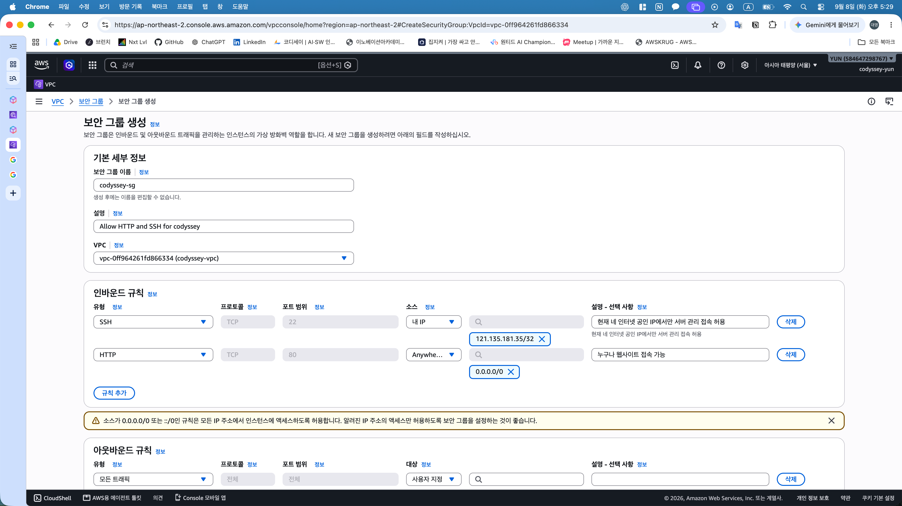

</details>

- **수행 내용:** 인바운드 규칙과 설명을 검토하는 중간 화면 기록
- **확인 포인트:** 아웃바운드 대상 입력 완료 전 화면으로서 최종 설정과의 구분

### 05-03 아웃바운드 규칙 재설정

<details>
<summary>아웃바운드 규칙 재설정 — 이미지 보기</summary>

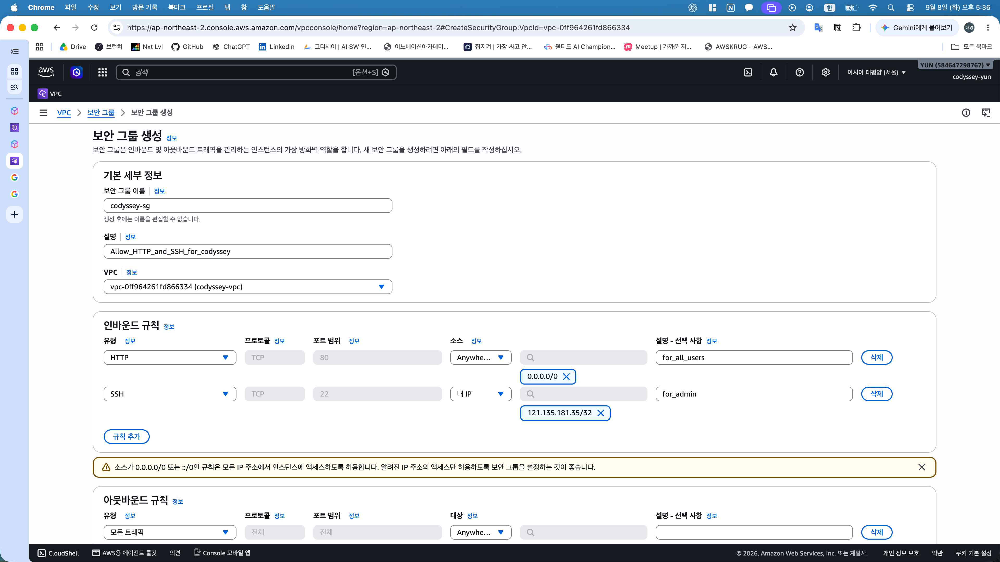

</details>

- **수행 내용:** HTTP·SSH 인바운드 유지 및 모든 트래픽 아웃바운드 규칙의 재입력 화면 확인
- **확인 포인트:** 패키지 다운로드용 외부 통신 허용 구성, 후속 SSH 세션에서 인터넷 통신 성공 확인

### 05-05 키페어 생성과 태그 지정

<details>
<summary>키페어 이름과 태그 지정 — 이미지 보기</summary>

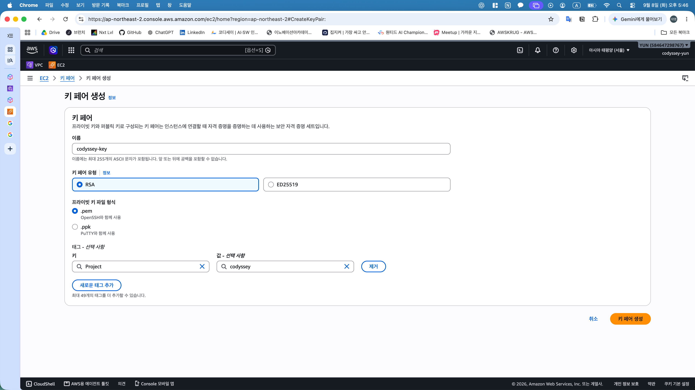

</details>

- **수행 내용:** RSA·`.pem` 형식 선택, 키페어 이름 `codyssey-key`와 `Project=codyssey` 태그 입력
- **확인 포인트:** 실습 리소스 식별과 SSH 접속용 키파일 준비

---

## 06. EC2 생성 설정

준비한 네트워크와 접근 제어를 적용한 웹 서버 생성 과정

### 06-01 인스턴스 이름과 AMI 선택

<details>
<summary>인스턴스 이름과 AMI 선택 — 이미지 보기</summary>

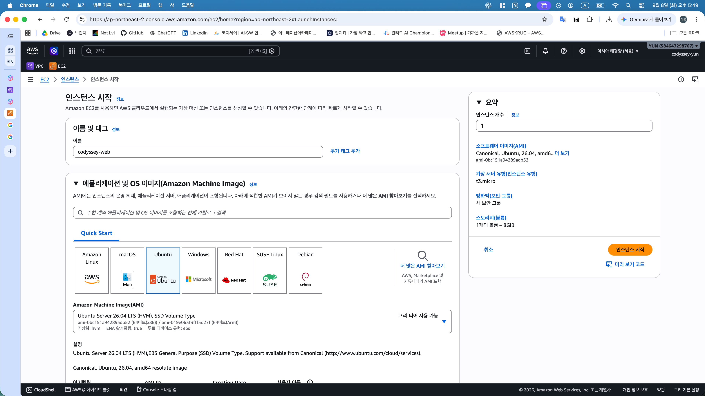

</details>

- **수행 내용:** 이름 `codyssey-web` 및 Ubuntu Server 26.04 LTS x86 이미지 선택

### 06-02 인스턴스 유형과 키페어 지정

<details>
<summary>인스턴스 유형과 키페어 지정 — 이미지 보기</summary>

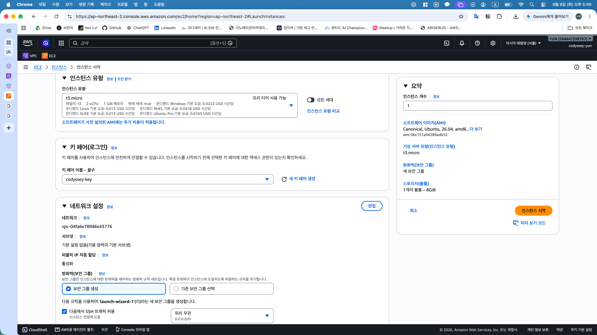

</details>

- **수행 내용:** `t3.micro` 및 기존 키페어 `codyssey-key` 선택
- **확인 포인트:** 네트워크 변경 전 화면에 남은 기본 VPC·새 보안 그룹 옵션의 중간 상태 기록

### 06-03 루트 스토리지 설정

<details>
<summary>루트 스토리지 설정 — 이미지 보기</summary>

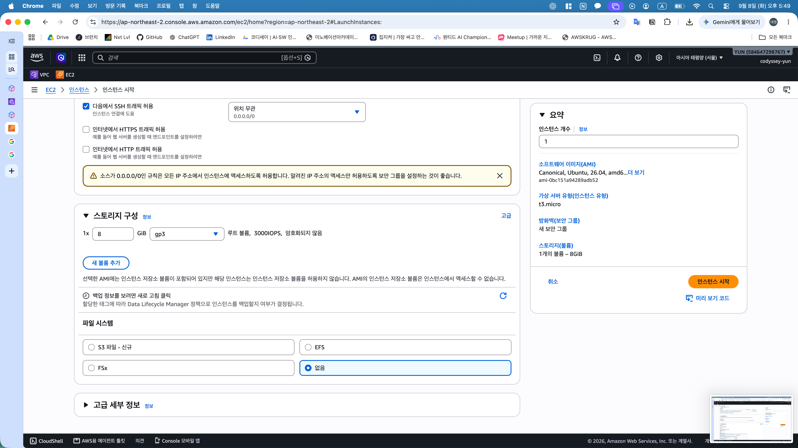

</details>

- **수행 내용:** 루트 볼륨 8GiB와 gp3 유형 확인
- **확인 포인트:** 화면 상단의 SSH 전체 공개 옵션은 보안 그룹 변경 전 상태, 기존 `codyssey-sg` 선택 화면은 트러블 슈팅 보고서의 IAM 사례에서 확인

[EBS와 Docker 파일 연결 이해](ebs-docker-explained.md) — 디스크 역할과 컨테이너의 파일 사용 방식 설명

---

## 07. SSH 접속과 인터넷 통신 검증

로컬 Mac에서 EC2 접속 후 서버의 외부 통신 가능 여부 검증

### 07-01 개인 키 권한 설정과 SSH 접속

- **수행 내용:** `chmod 400` 적용 후 `ubuntu@43.203.235.49` 접속 및 Ubuntu 26.04 LTS 배너 확인
- **확인 포인트:** 프롬프트 `ubuntu@ip-10-0-1-205` 확인을 통한 EC2 내부 세션 진입 검증

### 07-02 EC2 인터넷 아웃바운드 확인

<details>
<summary>SSH 접속 및 EC2 인터넷 아웃바운드 확인 — 이미지 보기</summary>

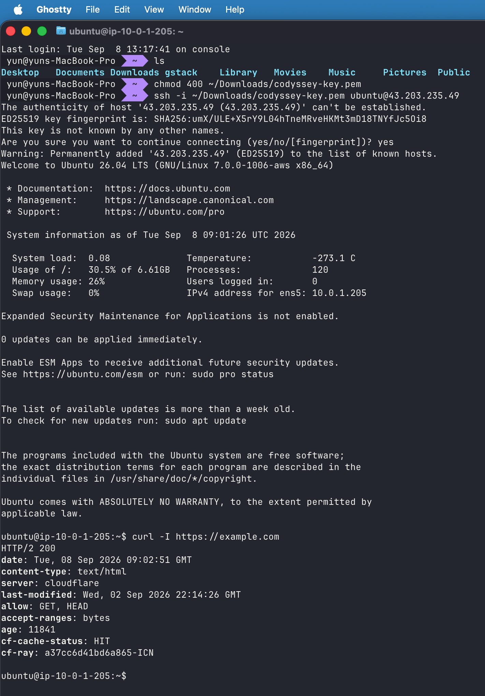

</details>

- **수행 내용:** EC2 내부에서 `curl -I https://example.com` 실행 및 `HTTP/2 200` 수신
- **확인 포인트:** EC2의 DNS 조회와 외부 HTTPS 통신 성공 확인

---

## 08. Nginx 설치와 내부 응답 확인

호스트 운영체제에 Nginx 설치 후 서비스 상태와 정적 파일 응답 검증

### 08-01 패키지 목록 갱신

<details>
<summary>패키지 목록 갱신 — 이미지 보기</summary>

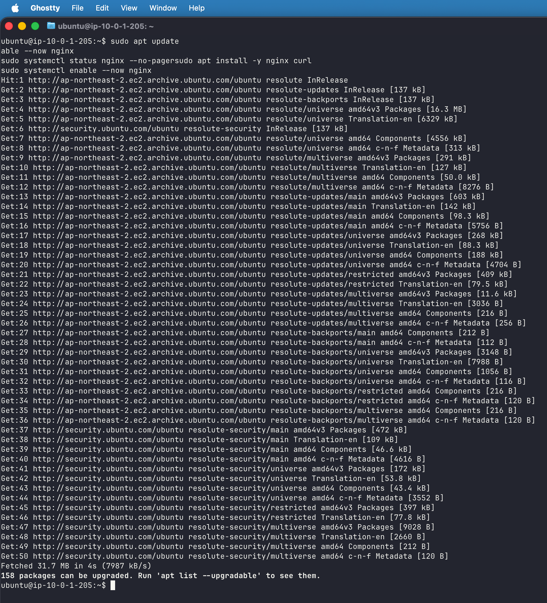

</details>

- **수행 내용:** Ubuntu 저장소에서 패키지 목록 다운로드 및 `apt update` 완료 확인
- **확인 포인트:** 외부 패키지 저장소 접근과 Nginx 설치 준비

### 08-02 Nginx 설치 완료

<details>
<summary>Nginx 설치 완료 — 이미지 보기</summary>

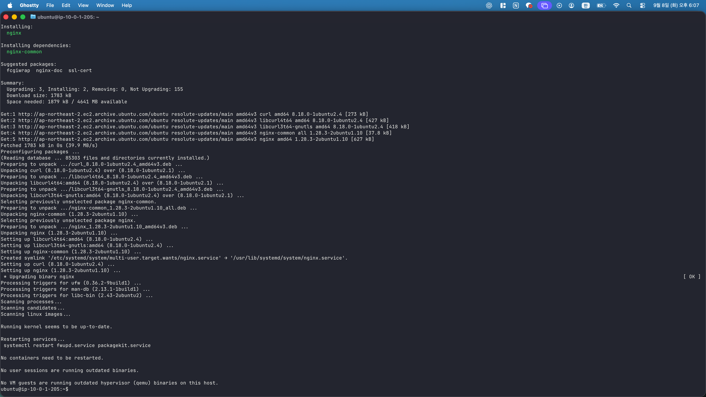

</details>

- **수행 내용:** Nginx·의존 패키지 다운로드와 설치 완료 로그 확인
- **확인 포인트:** 웹 서버 실행에 필요한 패키지 준비 완료

### 08-03 Nginx 서비스 실행 확인

<details>
<summary>Nginx 서비스 실행 확인 — 이미지 보기</summary>

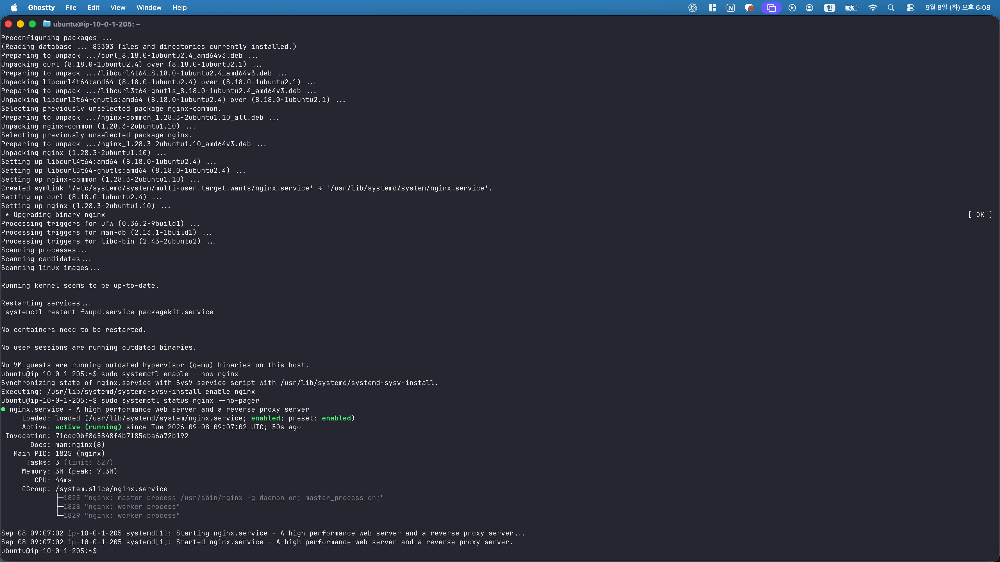

</details>

- **수행 내용:** `systemctl enable --now nginx` 및 `systemctl status nginx --no-pager` 실행
- **확인 포인트:** 서비스 `active (running)`과 부팅 시 자동 시작 `enabled` 확인

---

## 09. 외부 접속 검증

EC2 외부의 Mac 터미널과 브라우저에서 실제 HTTP 응답 검증

### 09-01 Mac 터미널의 메인 페이지 검증

<details>
<summary>Mac 터미널의 메인 페이지 검증 — 이미지 보기</summary>

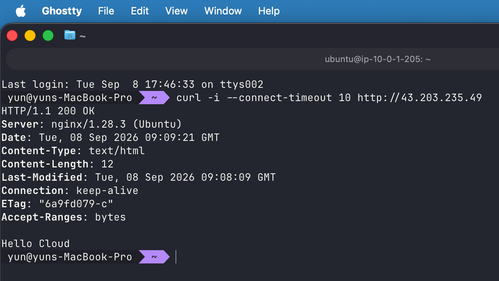

</details>

- **수행 내용:** Mac에서 `curl -i --connect-timeout 10 http://43.203.235.49` 실행
- **확인 포인트:** `HTTP/1.1 200 OK` 및 `Hello Cloud` 확인을 통한 외부 HTTP 접속 성공 검증

### 09-02 브라우저의 메인 페이지 검증

<details>
<summary>브라우저의 메인 페이지 검증 — 이미지 보기</summary>

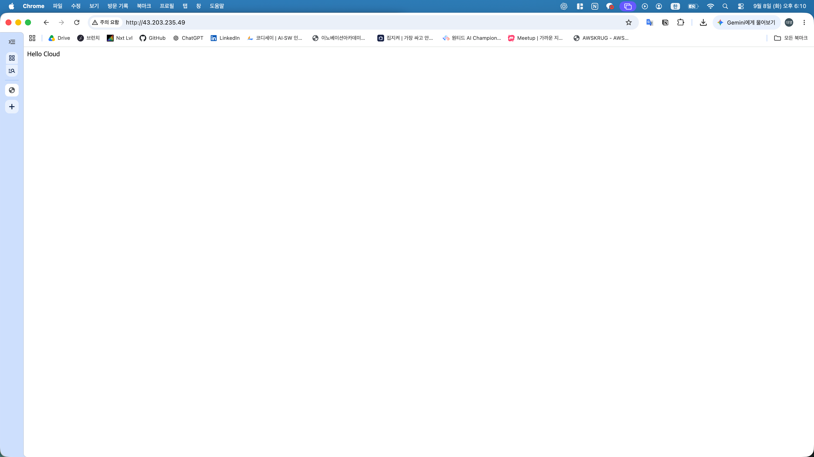

</details>

- **수행 내용:** 브라우저에서 퍼블릭 IPv4 주소의 메인 페이지 접근
- **확인 포인트:** 페이지의 `Hello Cloud` 표시와 사용자 관점의 웹 접속 확인

### 09-04 외부 health 200 확인

<details>
<summary>외부 health 200 확인 — 이미지 보기</summary>

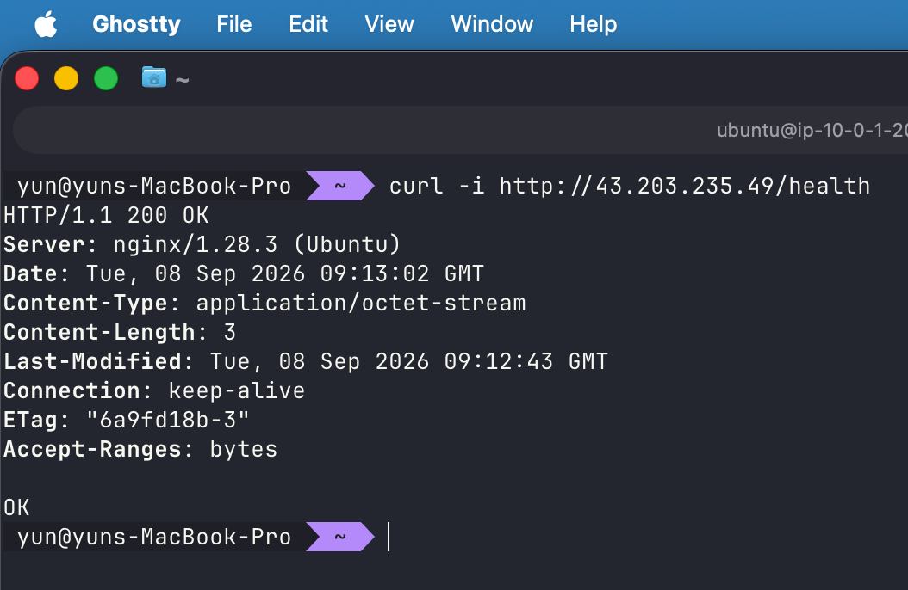

</details>

- **수행 내용:** Mac에서 `curl -i http://43.203.235.49/health` 실행
- **확인 포인트:** `HTTP/1.1 200 OK`와 본문 `OK` 확인을 통한 기본 과제 B 방식 검증 완료

---

## 관련 보고서

[IAM 권한 오류 및 health 404 트러블 슈팅 보고서](../05_트러블_슈팅/troubleshooting.md) — 오류 캡처·원인 검토·조치·검증 결과·재발방지 별도 정리

## 동료 평가 핵심 설명

| 질문 주제 | 설명 요점 |
|---|---|
| EC2 이전의 네트워크 구성 이유 | 서버 생성 시 배치할 VPC·서브넷과 인터넷 경로의 사전 준비 |
| Public Subnet의 의미 | 인터넷 게이트웨이 방향 기본 경로가 연결된 서브넷 |
| 라우팅 테이블과 보안 그룹의 차이 | 목적지별 전달 경로 지정과 접속 허용 범위 제어의 역할 구분 |
| IAM과 SSH 사용자의 차이 | AWS 리소스 작업 권한 사용자와 EC2 운영체제 로그인 사용자의 구분 |
| SSH와 HTTP의 공개 범위 차이 | 관리 접속의 내 IP 제한 및 웹 서비스의 전체 IPv4 공개 |
| localhost와 외부 IP 검증의 차이 | 서버 내부 실행 확인과 인터넷 경로·접근 제어를 포함한 실제 접속 확인 |

## 현재 완료 범위와 후속 작업

| 구분 | 현재 상태 |
|---|---|
| 네트워크 구성·EC2 접속 | 구성 과정과 SSH·인터넷 통신 증빙 확보 |
| Nginx 기본 배포 | 설치·실행·내부 메인 응답 증빙 확보 |
| 외부 접속 검증 | 터미널·브라우저 메인 접속 및 외부 `/health` 200 증빙 확보 |
| 정책 보완 최종 화면·인스턴스 상세 설정 | 최종 권한 목록·리소스 ID·볼륨 종료 시 삭제 설정 등의 추가 증빙 대상 |
| Docker·HTTPS 보너스 | [Docker 기록](../04_Docker/docker.md)과 [HTTPS 기록](../03_HTTPS/https.md)의 구축·검증 증빙 확보 |
| 리소스 종료·삭제 및 비용 확인 | 미진행, 최종 증빙 확보 후 수행 대상 |
| README·정리 체크리스트 | 실제 구성과 수행 상태에 맞춘 후속 갱신 대상 |

**평가 범위: 기본 웹 서비스 구축 및 외부 검증까지의 수행 기록, 전체 과제 정리 완료 이전의 중간 산출물**
