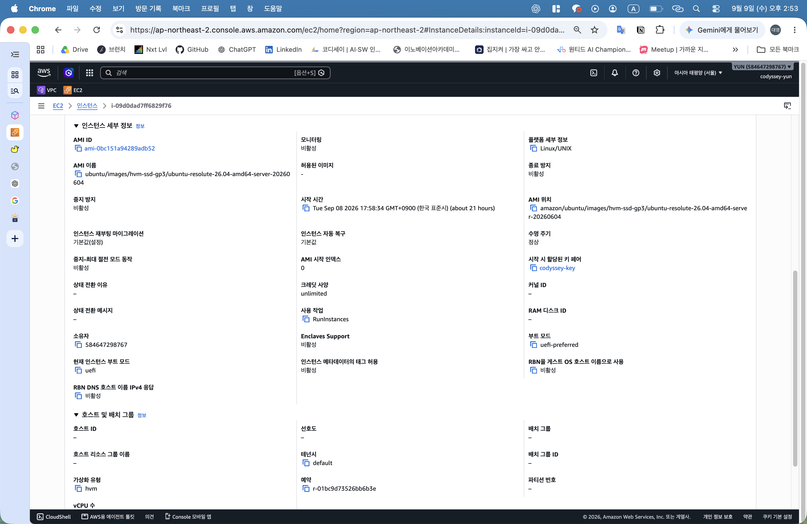
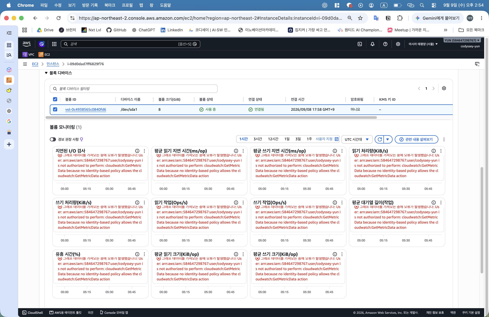
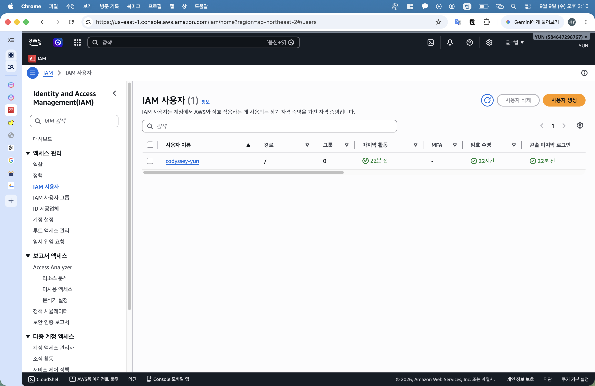
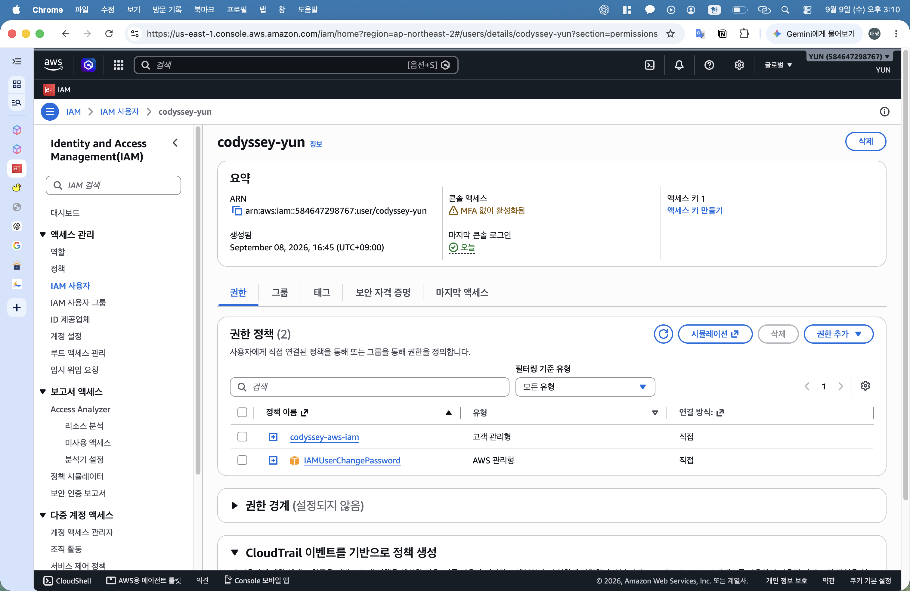
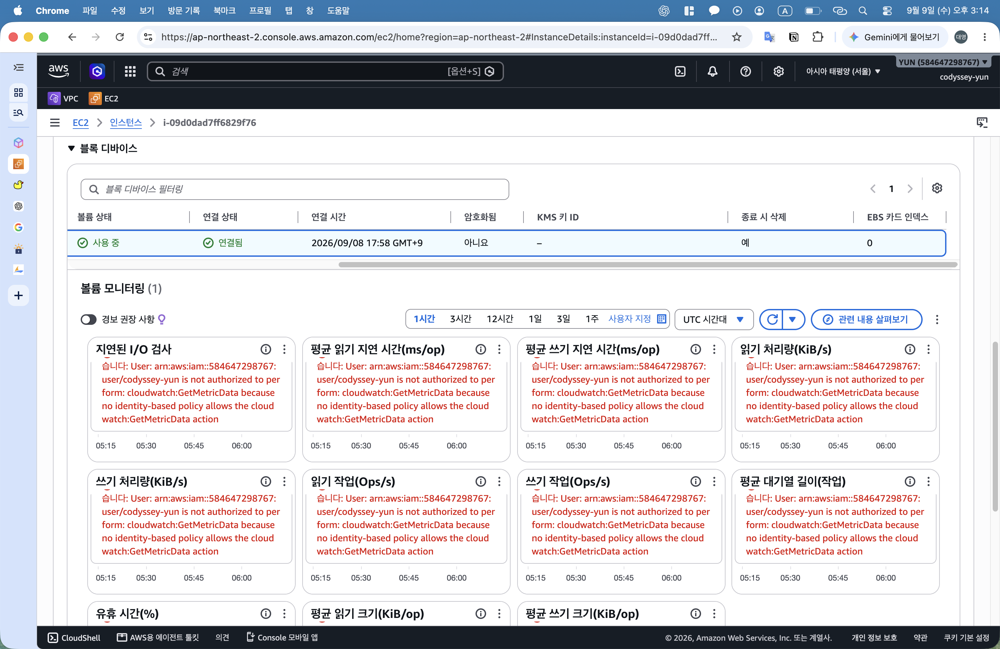

# 외부 접속 검증 기록

- 검증 방식: **B — GET `/health`**
- HTTP: `http://43.203.235.49/health` → `200 OK`, 본문 `OK`
- HTTPS: `https://codyssey.duckdns.org/health` → 인증서 검증 오류 없는 `200 OK`, 본문 `OK`
- 메인 페이지: `Hello Cloud (Docker)` 응답
- 검증 일자: 2026-09-08, 이후 실시간 상태와 구분되는 기록

## 최종 증빙

### 외부 HTTP health 검증

외부 HTTP health 200 — 이미지 보기

HTTP 200 및 본문 OK 확인

### 외부 HTTPS health 검증

외부 HTTPS health 200 — 이미지 보기

인증서 검증 생략 없는 HTTPS 200 및 본문 OK 확인

### 브라우저 검증

HTTPS 브라우저 — 이미지 보기

HTTPS 주소와 Hello Cloud (Docker) 표시 확인

## 관련 문서

- [Docker 내부 검증 및 컨테이너 상태](../04_Docker/docker.md)
- [HTTPS 적용과 갱신 검증](../03_HTTPS/https.md)
- [프로젝트 안내](../../README.md)

## 기존 캡처 재점검 — 2026-09-08

| 확인 항목 | 판독 결과 | 근거 |
|---|---|---|
| VPC·IGW 식별 정보 | `vpc-0ff964261fd866334`, `igw-0637dc3e8b222c179` | [IGW 연결 화면](../../outputs/04_IGW_라우팅/04_02_IGW_VPC_연결.png) |
| 라우팅 테이블·서브넷 | `rtb-056aecce93e02438e`, `subnet-0c7f8c97172ee3de3`, 명시적 연결 완료 | [연결 완료 화면](../../outputs/04_IGW_라우팅/04_06_라우팅_서브넷_연결.png) |
| EC2 생성 시 선택 | `codyssey-web`, Ubuntu 26.04 LTS, `ami-0bc151a94289adb52`, `t3.micro`, `codyssey-key` | [AMI](../../outputs/06_EC2_EBS/06_01_EC2_AMI.png), [유형·키페어](../../outputs/06_EC2_EBS/06_02_EC2_유형_키페어.png) |
| EBS 생성 시 선택 | gp3 8 GiB, 루트 볼륨 | [스토리지 입력 화면](../../outputs/06_EC2_EBS/06_03_EC2_네트워크_스토리지.png) |
| SG 기존 규칙 및 추가 입력 | `sg-0a04831223ba5fc2d`, 기존 SSH 본인 IP/32·HTTP 전체 IPv4, HTTPS 443 추가 입력 | [SG 편집 화면](../../outputs/11_HTTPS/11_04_SG_HTTPS.png), 후속 외부 HTTPS 성공으로 접근 가능 확인 |
| IAM 최초 정책 범위 | EC2 서비스 1개, 모든 리소스, `aws:RequestedRegion = ap-northeast-2` | [정책 생성 검토 화면](../../outputs/02_IAM/02_03_IAM_정책_생성.png) |
| IAM 사용자 생성 시 정책 선택 | `codyssey-yun`, `codyssey-aws-iam`, `IAMUserChangePassword` | [사용자 생성 검토 화면](../../outputs/02_IAM/02_05_IAM_콘솔_접속.png) |
| 설정 파일 보관 | Nginx 설정·웹 파일·갱신 훅의 캡처 전사 완료 | [설정 보관본](../../configs/README.md) |

## 최종 설정 추가 확인 — 2026-09-09

### EC2 보안·네트워크 연결

EC2 보안 확인 — 이미지 보기

- 인스턴스 ID: `i-09d0dad7ff6829f76`
- 서브넷: `subnet-0c7f8c97172ee3de3`, 기존 VPC·라우팅 연결 캡처와 일치
- 보안 그룹: `sg-0a04831223ba5fc2d` / `codyssey-sg`
- 인바운드: SSH 22 본인 IP/32, HTTP 80·HTTPS 443 전체 IPv4
- 아웃바운드: 전체 트래픽 `0.0.0.0/0`
- IAM 인스턴스 역할: 미지정

### EC2 상세 설정

EC2 상세 확인 — 이미지 보기

- 실제 AMI: `ami-0bc151a94289adb52`, Ubuntu 26.04 amd64
- 키페어: `codyssey-key`
- 종료 방지: 비활성, EBS의 종료 시 삭제 설정과 별개 항목

### EBS 연결

EBS 연결 확인 — 이미지 보기

- 볼륨 ID: `vol-0c4938565c0840fd6`
- 장치: `/dev/sda1`, 크기 8 GiB, 상태 사용 중·연결됨
- 하단 오류: `cloudwatch:GetMetricData` 권한 부재에 따른 모니터링 그래프 조회 실패, 볼륨 연결 실패와 구분

### IAM 정책 확인

- [최종 정책 JSON](../../configs/iam-policy.json): 사용자 제공본 기준 보관
- `ec2:GetSecurityGroupsForVpc` 추가 및 EC2 서비스·서울 리전 제한 확인
- S3·RDS Action 미포함, 모든 서비스에 대한 Allow 미포함
- `Resource: "*"` 사용으로 실습 리소스별 제한은 미적용

### IAM 최종 연결 정책

IAM 사용자 확인 — 이미지 보기

IAM 사용자 `codyssey-yun` 1명, 소속 그룹 0개 확인

IAM 권한 확인 — 이미지 보기

- 연결 정책 2개: `codyssey-aws-iam`, `IAMUserChangePassword`
- 두 정책의 직접 연결 및 `AdministratorAccess` 미연결 확인
- 제공된 정책 JSON과 연결 목록 대조를 통한 EC2·VPC 실습 권한 및 비밀번호 변경 권한 확인
- S3·RDS 등 실습 무관 서비스 권한 미부여 확인
- CloudWatch 그래프 조회 권한은 과제 비필수로 추가하지 않기로 결정

### EBS 종료 시 삭제

EBS 종료 시 삭제 확인 — 이미지 보기

동일 인스턴스의 단일 연결 볼륨에서 `종료 시 삭제: 예` 확인. 실제 삭제 완료 여부는 EC2 종료 후 별도 확인 대상

### 재점검 결과

EC2·EBS 식별 정보, 연결 설정, EBS 종료 시 삭제, IAM 최종 정책·연결 목록 확인 완료. 리소스 정리 및 삭제 결과 확인은 미완료
