# HTTPS 적용 및 인증서 갱신 기록

- **실습 일자:** 2026-09-08
- **범위:** Duck DNS 연결·인증서 발급·TLS 적용·갱신 자동화·검증 증빙
- **관련 문서:** [프로젝트 안내](../../README.md), [Docker 실행 명령과 포트 매핑](../04_Docker/docker.md), [트러블 슈팅](../05_트러블_슈팅/troubleshooting.md)

## 적용 정보


- DNS: Duck DNS 서브도메인 `codyssey.duckdns.org` → EC2 퍼블릭 IPv4 연결
- 발급: EC2 호스트 Certbot의 webroot 인증 방식
- 적용: 컨테이너의 TLS 설정과 `/etc/letsencrypt` 읽기 전용 마운트
- HTTP: 자동 HTTPS 리디렉션 없이 기존 200 응답 유지
- 갱신: `certbot renew --dry-run` 성공, `certbot.timer` 활성화 확인
- 갱신 후 적용: deploy hook의 `docker exec codyssey-web nginx -t` 및 `nginx -s reload`

```bash
sudo certbot certonly --webroot \
  -w /home/ubuntu/codyssey-web \
  -d codyssey.duckdns.org
```

## 도메인 연결과 HTTPS 적용 과정


### 11-02 DNS HTTP 확인

<details>
<summary>11_02_DNS_HTTP_확인 — 이미지 보기</summary>

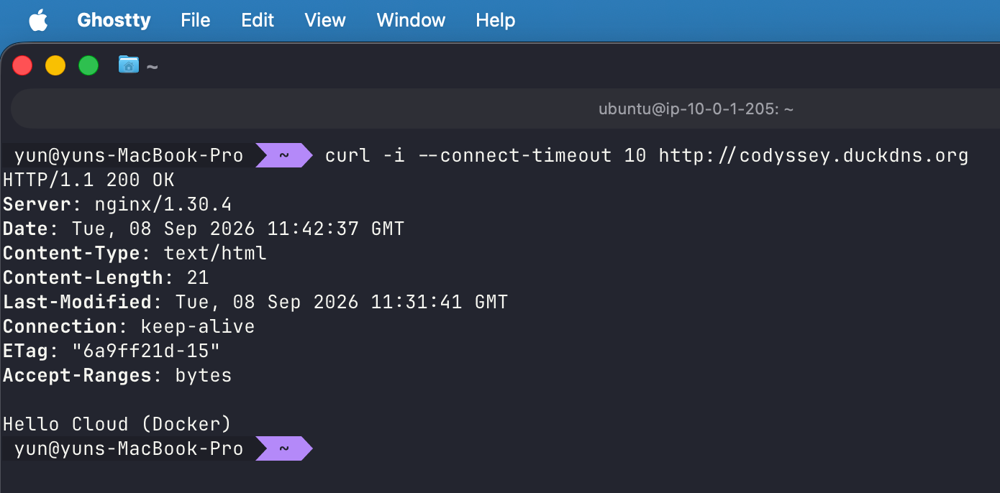

</details>

codyssey.duckdns.org의 HTTP 200 확인을 통한 도메인 연결 검증

### 11-03 DNS 브라우저

<details>
<summary>11_03_DNS_브라우저 — 이미지 보기</summary>

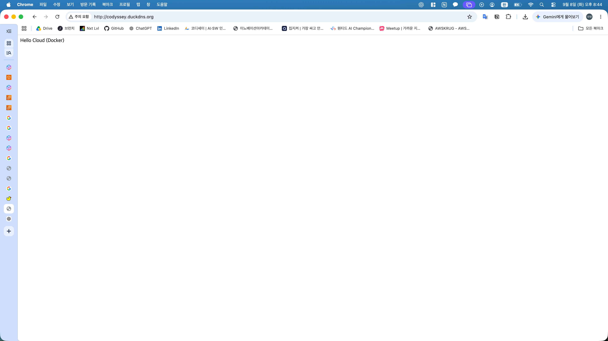

</details>

도메인 HTTP 페이지의 Hello Cloud (Docker) 확인

### 11-04 SG HTTPS

<details>
<summary>11_04_SG_HTTPS — 이미지 보기</summary>

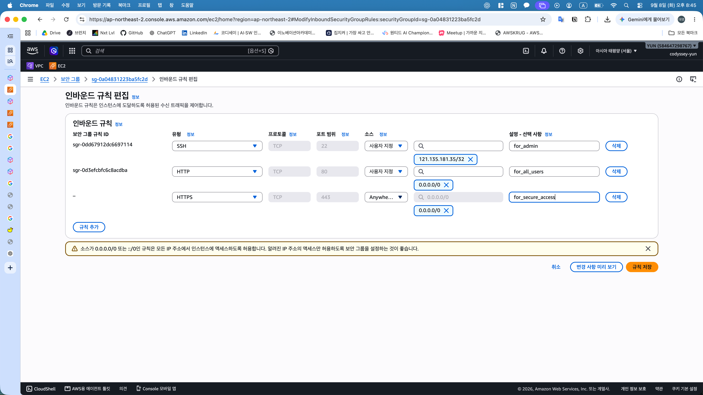

</details>

기존 SSH·HTTP 유지와 HTTPS TCP 443 전체 IPv4 허용 입력

### 11-05 Certbot 설치

<details>
<summary>11_05_Certbot_설치 — 이미지 보기</summary>

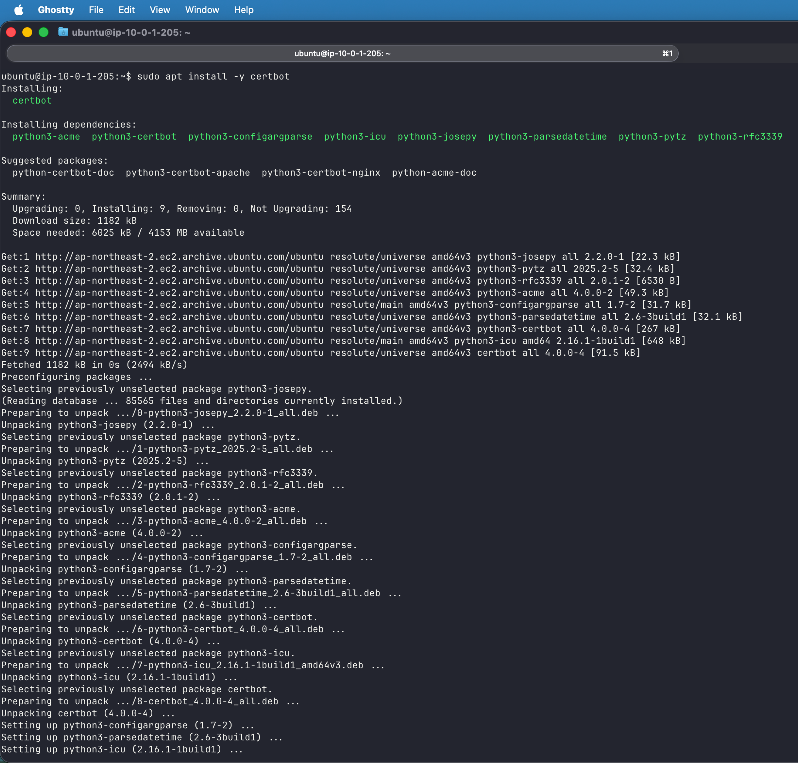

</details>

EC2 호스트의 Certbot 패키지 설치

### 11-06 인증서 발급

<details>
<summary>11_06_인증서_발급 — 이미지 보기</summary>

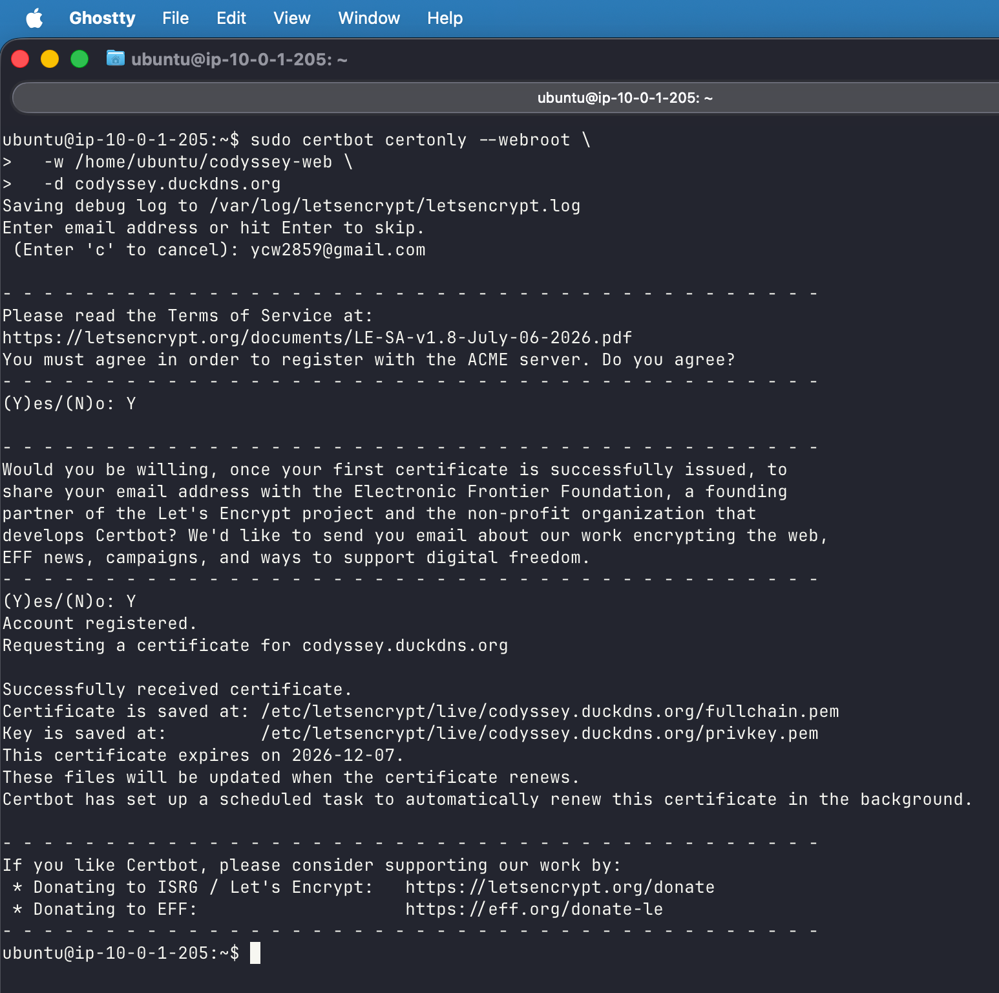

</details>

webroot 인증서 발급 성공 및 만료일 2026-12-07 확인

### 11-07 Nginx TLS 설정

<details>
<summary>11_07_Nginx_TLS_설정 — 이미지 보기</summary>

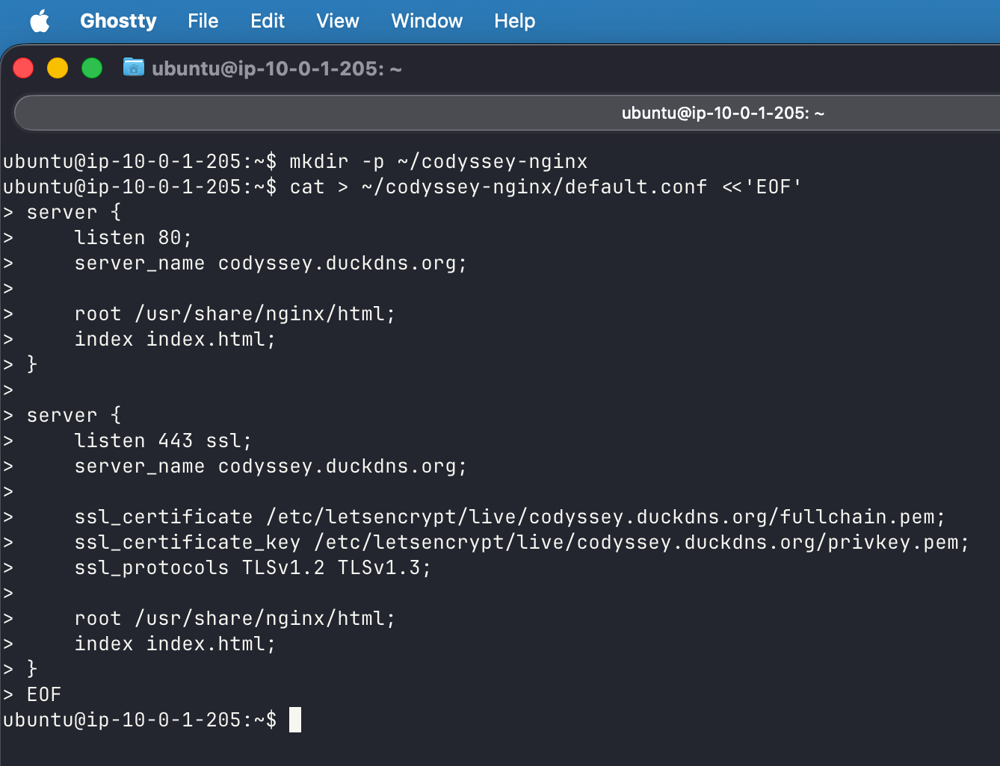

</details>

HTTP 80·HTTPS 443 서버 블록과 인증서 경로 작성

### 11-08 Nginx 설정 검사

<details>
<summary>11_08_Nginx_설정_검사 — 이미지 보기</summary>

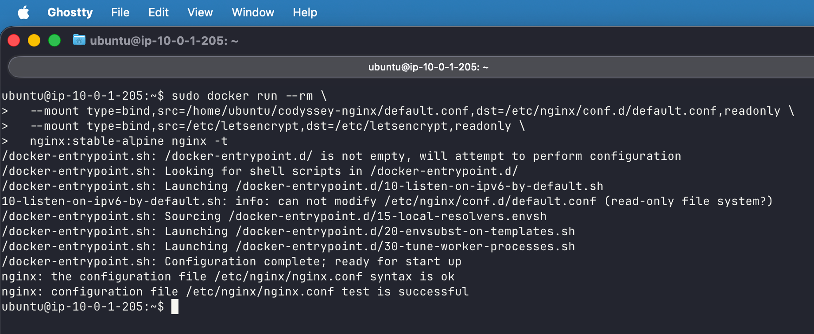

</details>

인증서 마운트 상태에서 nginx -t 성공 확인

### 11-09 HTTPS health

<details>
<summary>11_09_HTTPS_health — 이미지 보기</summary>

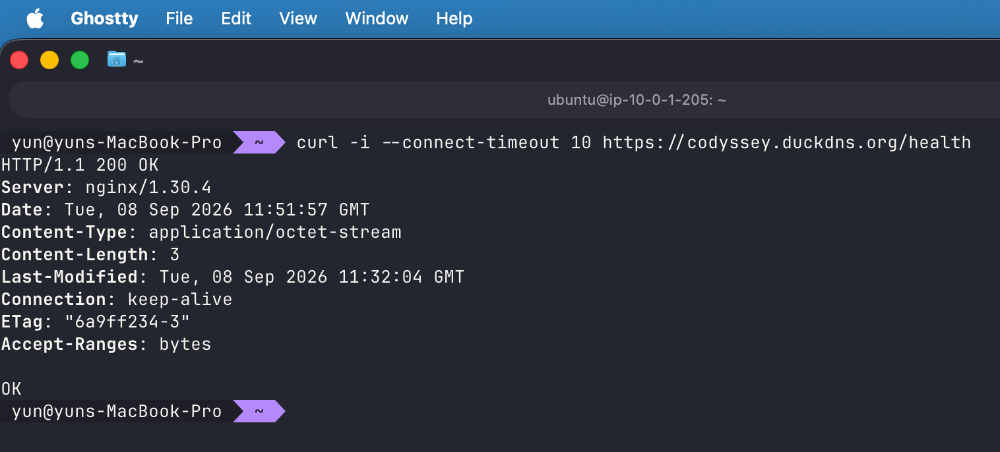

</details>

Mac의 HTTPS health 요청에서 인증서 검증 생략 없이 200 및 OK 확인

### 11-10 HTTPS 브라우저

<details>
<summary>11_10_HTTPS_브라우저 — 이미지 보기</summary>

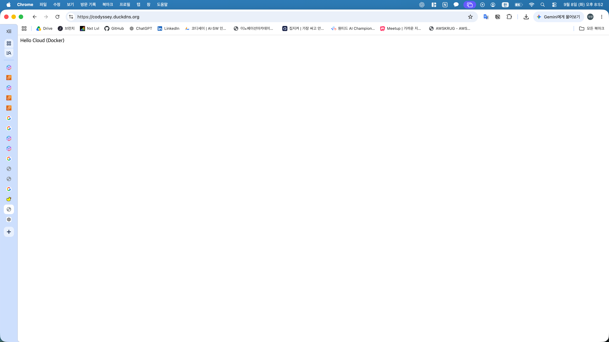

</details>

HTTPS 도메인 접속과 Hello Cloud (Docker) 표시 확인

## 인증서 갱신 자동화


### 12-01 인증서 갱신 테스트

<details>
<summary>12_01_인증서_갱신_테스트 — 이미지 보기</summary>

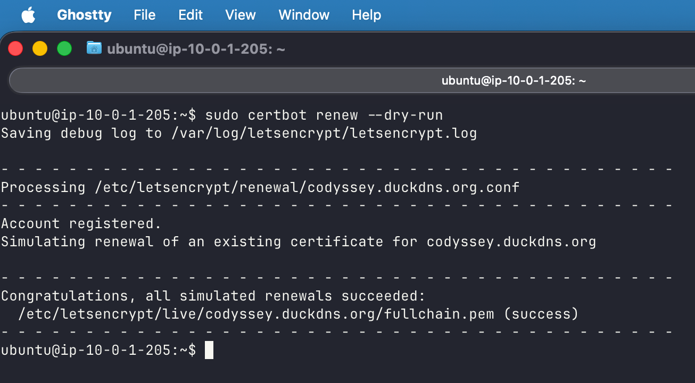

</details>

certbot renew --dry-run의 simulated renewals succeeded 확인

### 12-03 갱신 훅 구성과 타이머

<details>
<summary>12_03_갱신_훅_타이머 — 이미지 보기</summary>

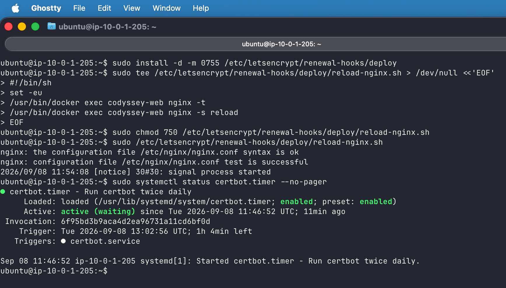

</details>

인증서 갱신 성공 후 실행할 deploy hook 폴더 생성 및 훅 구성. Nginx 검사·reload 훅 실행 성공과 certbot.timer active (waiting) 확인

## 검증 결론

- 인증서 검증 오류 없는 HTTPS health 200 및 브라우저 정상 표시 확인
- 인증서 갱신 모의 시험 성공, reload 훅 수동 실행 성공 및 타이머 대기 상태 확인
- Duck DNS 토큰 포함 원본 캡처의 공유 제외, 도메인 접속 결과를 통한 DNS 연결 증빙
