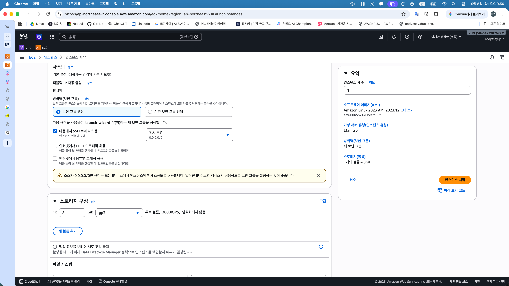
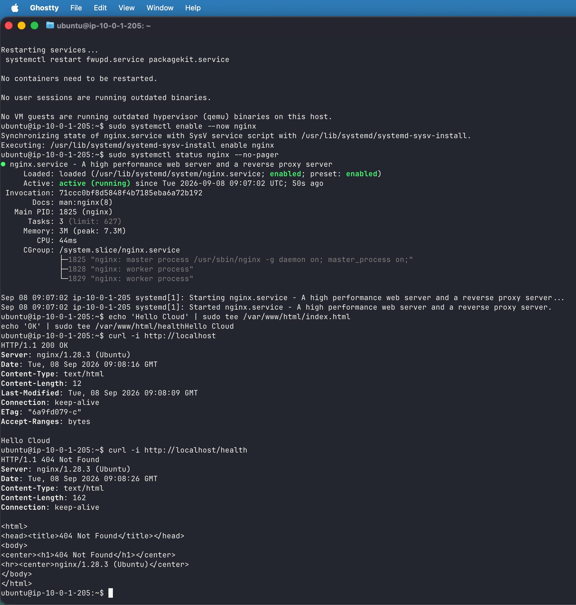
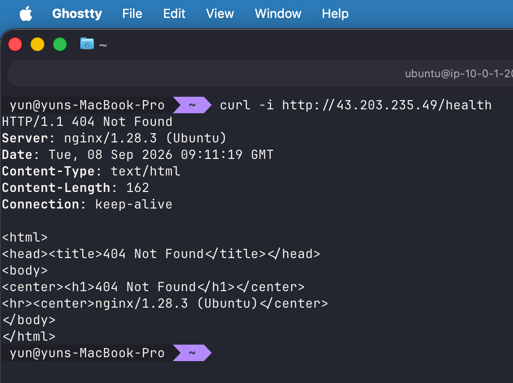
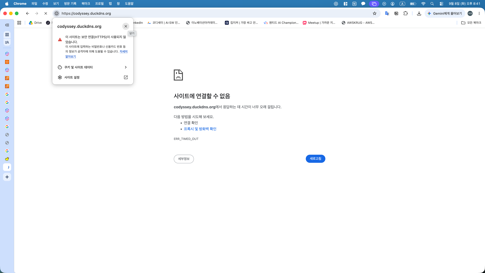

# AWS 웹 서비스 구축 — 트러블 슈팅 보고서

## 보고서 개요

- **발생 일자:** 2026-09-08
- **대상 환경:** 서울 리전 EC2, Ubuntu 26.04 LTS, 호스트 Nginx
- **대상 사례:** IAM 보안 그룹 조회 권한 누락 및 `/health` 404 응답
- **정리 구조:** 증상 → 가설 → 검증 → 조치 → 결과 → 재발방지
- **증빙 기준:** 캡처에서 확인한 사실과 대화에서 안내한 조치의 구분
- **관련 문서:** [기본 구축·검증 흐름](../01_기본_구축/basic-build-flow.md)

---

## 01. IAM 보안 그룹 조회 권한 누락

### 1. 증상

EC2 생성 화면에서 기존 보안 그룹 선택 시 `ec2:GetSecurityGroupsForVpc` 실행 권한 부족 경고 발생

<details>
<summary>EC2 보안 그룹 설정 참고 화면 — 이미지 보기</summary>



</details>

- **이미지 용도:** 21:50 재촬영한 EC2 시작 화면의 보안 그룹 설정 위치 참고
- **화면 구분:** 신규 보안 그룹·SSH 전체 허용·Amazon Linux 기본 선택 화면으로, 당시 IAM 오류 및 최종 배포 설정의 증빙과 구분
- **오류 기록:** 당시 대화에서 확인한 `ec2:GetSecurityGroupsForVpc` 권한 부족 메시지에 근거한 서술, 기존 오류 캡처 삭제

- **발생 시점:** 17:50경 실습 중, 대화 기록 기준
- **작업 대상:** 실습 서브넷과 기존 보안 그룹 `codyssey-sg` 선택
- **오류 영향:** 선택한 VPC에서 보안 그룹의 유효성을 검사하는 콘솔 작업의 권한 부족
- **구분 사항:** SSH·HTTP 접속 규칙 오류와 별개인 AWS API 호출 권한 문제

### 2. 원인 가설

실습용 IAM 정책의 허용 Action 목록에서 `ec2:GetSecurityGroupsForVpc` 누락 가능성

- 기존 정책의 `ec2:Describe*`는 `Describe`로 시작하는 작업만 포함
- `GetSecurityGroupsForVpc`는 `Get`으로 시작하는 별도 작업으로서 추가 허용 필요

### 3. 검증

| 확인 대상 | 관찰 내용 | 판단 |
|---|---|---|
| 당시 대화의 오류 메시지 | `ec2:GetSecurityGroupsForVpc` 권한 부족 명시 | 누락 작업의 구체적 식별, 원본 오류 캡처 삭제 |
| 작업 계획의 초기 정책 | `ec2:Describe*` 포함 및 해당 Get 작업 미포함 | 초기 권한 목록의 누락 확인 |
| 사용자 제공 최종 정책 | 2026-09-09 제공 JSON에 `ec2:GetSecurityGroupsForVpc` 포함 | [정책 보관본](../../configs/iam-policy.json)으로 보완 내용 확인 |

### 4. 조치

대화에서 안내한 기존 사용자 지정 정책 보완 절차

1. 계정 소유자로 IAM 정책 `codyssey-aws-iam` 편집 화면 진입
2. 기존 Action 배열에 아래 권한 한 줄 추가
3. 기존 서울 리전 조건과 나머지 권한 범위 유지
4. 정책 저장 후 IAM 사용자 `codyssey-yun`으로 재접속
5. EC2 생성 화면에서 기존 보안 그룹 재선택

**Action 배열에 추가할 항목 — 전체 정책을 대체하지 않는 수정 부분**

```json
"ec2:GetSecurityGroupsForVpc"
```

기존 배열 중간 삽입 시 항목 구분용 쉼표 유지

### 5. 결과

- **대화 확인:** 권한 추가 안내 이후 사용자의 인스턴스 시작 완료 보고
- **후속 증빙:** [SSH 접속 캡처](../../outputs/07_SSH/07_01_SSH_접속.png)의 실제 EC2 접속 성공
- **추가 확인:** 2026-09-09 사용자 제공 최종 정책 JSON에서 해당 Action 포함 확인
- **증빙 한계:** 정책 내용은 사용자 제공본 기준, [최종 연결 정책 목록](../../outputs/02_IAM/02_07_IAM_권한_확인.png)은 추가 확인 완료, 경고 해소 직후 화면은 미확보

### 6. 재발방지

- 오류 메시지의 정확한 API 이름과 정책 Action 목록 대조
- `Describe*`만으로 모든 조회 작업을 포괄한다는 가정 배제
- 필요한 개별 작업 추가와 서울 리전 제한 유지
- 정책 변경 전후 JSON 및 경고 해소 화면의 동시 보관

---

## 02. Nginx health 경로의 404 응답

### 1. 증상

메인 페이지 정상 응답과 `/health` 경로의 404 응답 동시 발생

**EC2 내부 확인 — 18:08경**

<details>
<summary>내부 메인 200 및 health 404 — 이미지 보기</summary>



</details>

- `http://localhost` 요청의 `200 OK` 및 `Hello Cloud` 확인
- `http://localhost/health` 요청의 `404 Not Found` 확인
- Nginx 실행 상태와 특정 경로의 응답 문제 구분

**Mac 외부 확인 — 18:11경**

<details>
<summary>외부 health 404 — 이미지 보기</summary>



</details>

- `http://43.203.235.49/health` 요청의 동일한 404 확인
- HTTP 응답 수신에 따른 외부 연결 성공 확인
- 연결 시간 초과와 구분되는 웹 서버의 경로 처리 오류

### 2. 원인 가설

웹 루트 `/var/www/html` 아래의 `health` 파일 미생성 또는 정상 생성 실패 가능성

- 메인 페이지 정상 동작을 근거로 Nginx 전체 중단 가능성 축소
- 내부·외부에서 동일한 404 수신에 따른 파일 경로·웹 루트 설정 우선 검토
- 파일 생성 명령 재실행 후 해결된 결과를 근거로 파일 생성 누락 또는 실패 가능성 판단
- 조치 전 파일 목록과 Nginx 오류 로그 미확보에 따른 정확한 최초 실패 원인의 확정 제한

### 3. 검증

| 위치 | 요청 | 조치 전 관찰 |
|---|---|---|
| EC2 내부 | `http://localhost` | `200 OK`, `Hello Cloud` |
| EC2 내부 | `http://localhost/health` | `404 Not Found` |
| Mac 외부 | `http://43.203.235.49/health` | `404 Not Found` |

동일 서버의 경로별 응답 차이를 통한 네트워크 연결 문제와 웹 콘텐츠 문제의 구분

### 4. 조치

대화에서 안내한 EC2 내부의 정적 health 파일 재생성 및 검증 절차

**EC2 SSH 세션 — 파일 생성과 내부 확인**

```bash
echo 'OK' | sudo tee /var/www/html/health
curl -i http://localhost/health
```

- `/var/www/html/health`에 고정 응답 `OK` 기록
- 정적 파일 추가에 따른 Nginx 설정 변경·재시작 없는 조치
- 내부 재검증 명령의 안내 기록, 해당 실행 결과 캡처 미확보

**Mac 터미널 — 외부 재검증**

```bash
curl -i http://43.203.235.49/health
```

### 5. 결과

**외부 재검증 — 18:13경**

<details>
<summary>외부 health 200 해결 — 이미지 보기</summary>


</details>

- 동일 URL의 `HTTP/1.1 200 OK` 및 본문 `OK` 확인
- 조치 전 404에서 조치 후 200으로의 응답 변화 확인
- 기본 과제 B 방식인 외부 GET `/health` 검증 완료
- 파일 재생성 안내와 사용자의 성공 보고, 최종 외부 응답 캡처에 근거한 복구 확인

### 6. 재발방지

- 파일 생성 명령의 한 줄 단위 실행과 출력 확인
- `ls -l /var/www/html/health` 및 `cat /var/www/html/health`를 통한 파일 존재·내용 확인
- 서버 내부 검증 후 외부 검증 순서 유지
- 반복 오류 발생 시 `sudo nginx -T`의 웹 루트와 Nginx 오류 로그 확인
- 조치 전후 동일 URL·동일 명령 사용과 응답 캡처 보관

---

## 사례별 결론

| 사례 | 핵심 원인 또는 판단 | 확인된 결과 |
|---|---|---|
| IAM 권한 경고 | 초기 정책의 개별 조회 Action 누락 | 추가 안내 후 인스턴스 시작 보고와 SSH 접속 확인, 최종 정책 증빙 보완 필요 |
| health 404 | 정적 health 파일의 생성 누락·실패 가능성 | 재생성 안내 후 외부 `200 OK`와 `OK` 응답 확인 |

**평가 요점: 오류 계층 식별, 최소 범위 조치, 동일 조건 재검증, 증빙으로 확인 가능한 결과와 미확인 사항의 구분**


## 03. HTTPS 적용 전 브라우저 연결 실패

### 증상

<details>
<summary>HTTPS 적용 전 연결 시간 초과 — 이미지 보기</summary>



</details>

20:41경 HTTPS URL에서 ERR_TIMED_OUT 발생, 이후 HTTP curl 요청의 정상 응답 확인

### 가설·검증

당시 HTTP 전용 컨테이너 운영과 HTTPS 443·인증서 설정 미완료 상태, 브라우저의 HTTPS 접속과 curl의 HTTP 접속 차이 확인

### 조치

보안 그룹 TCP 443 허용, Certbot webroot 인증서 발급, Nginx TLS 설정 및 컨테이너 443:443 매핑 적용

### 결과

[HTTPS health 200](../../outputs/11_HTTPS/11_09_HTTPS_health.png) 및 [HTTPS 브라우저 접속](../../outputs/11_HTTPS/11_10_HTTPS_브라우저.png) 확인

### 재발방지

HTTP·HTTPS URL 구분, 보안 그룹·컨테이너 포트·인증서 수신 설정의 단계별 확인
