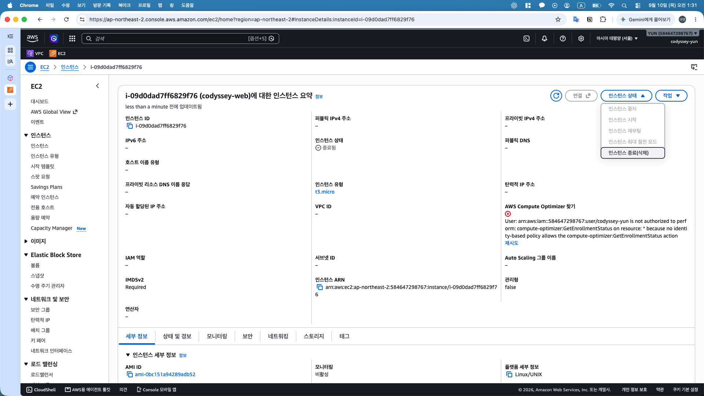
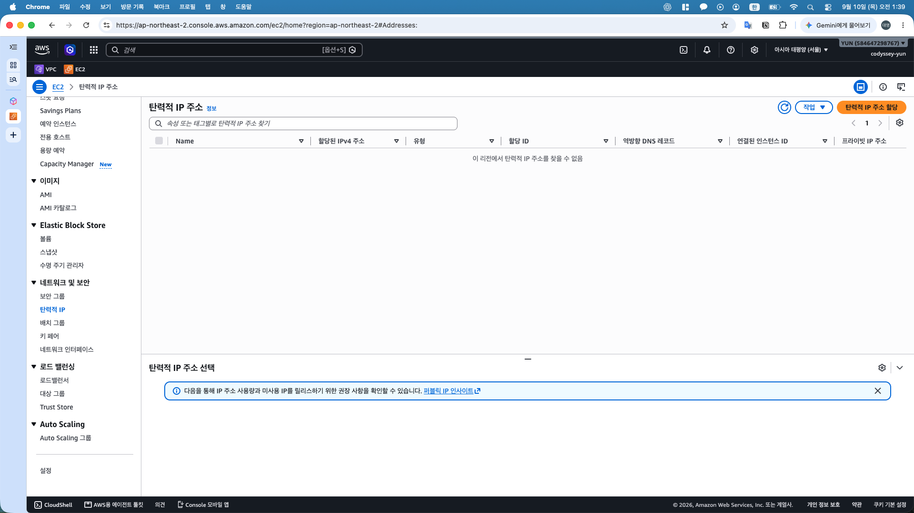
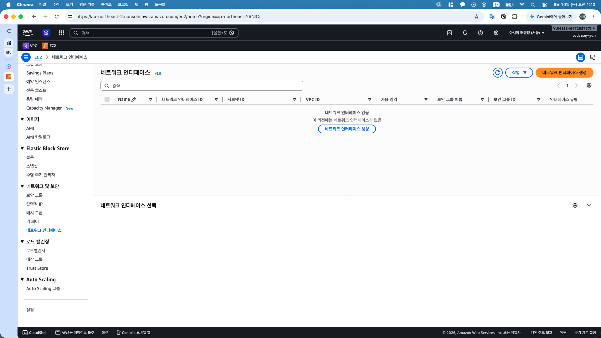
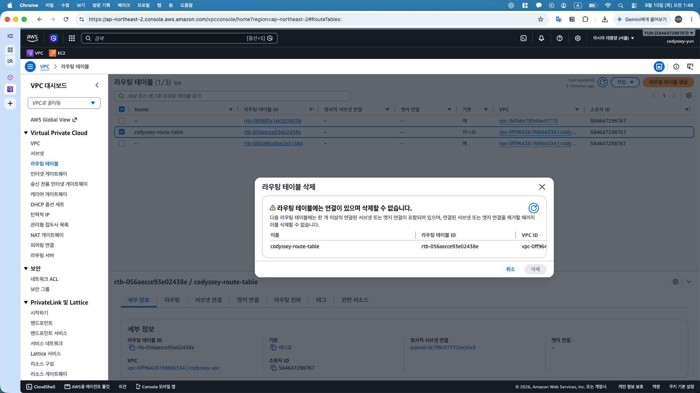
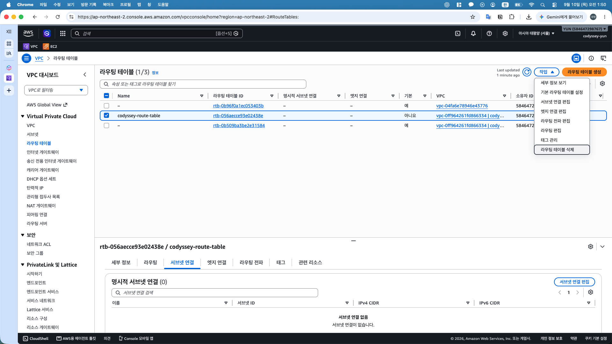
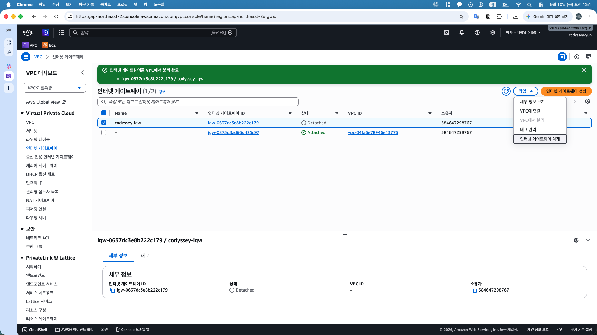
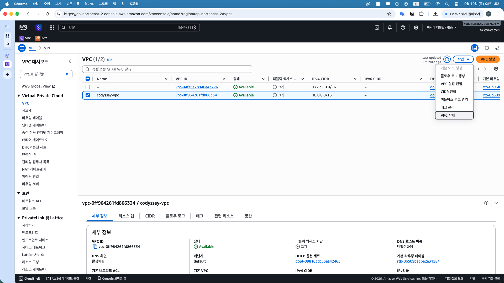
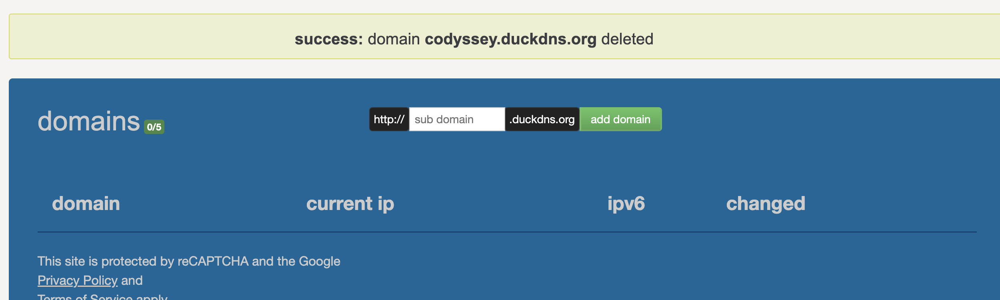
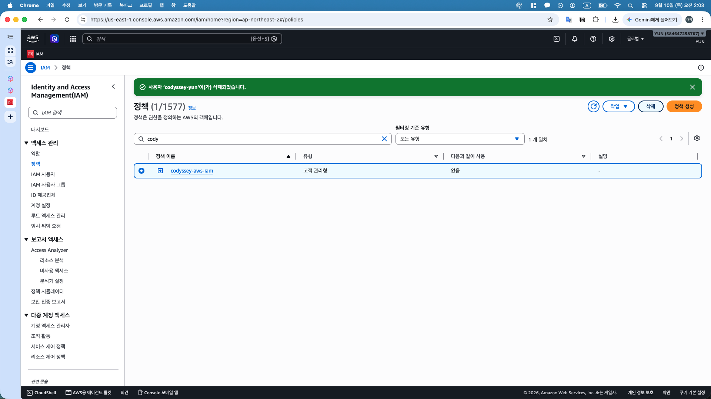
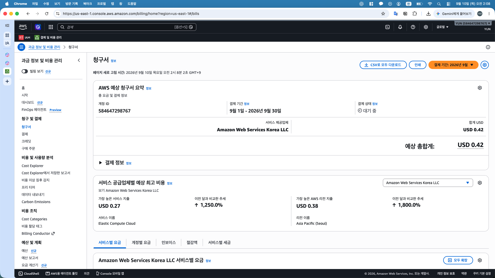

# 리소스 정리 체크리스트

## 정리 현황

- 대상: AWS 서울 리전 `ap-northeast-2`의 본 실습 리소스 및 실습 전용 DuckDNS 설정
- 현재 상태: 실습 리소스 정리 완료, 사용자 완료 확인 및 제공 캡처 대조 완료
- 정리일: 2026-09-10, 정확한 최종 삭제 시각 미기록
- 최초 비용 확인: 2026-09-10 02:08:02 KST, 후속 비용 확인 대기
- 기록 기준: 삭제 완료 화면·삭제 전 작업 화면·사용자 완료 확인의 구분
- 증빙 시각: 2026-09-10 KST 기준 캡처 파일명 시각, 비용 확인 시각은 화면의 새로고침 시각 기준
- 미생성 항목: 사용자 생성 이력 확인 또는 콘솔 목록 확인 근거의 구분

## 1. 자료 확보 및 대상 구분

- [x] HTTP·HTTPS 및 Docker 검증 캡처의 로컬 보관 확인 — 기존 `outputs/09_외부_검증/`, `10_Docker/`, `11_HTTPS/`, `12_최종_검증/` 확인
- [x] 아키텍처 이미지와 실습·트러블 슈팅 문서의 로컬 보관 확인
- [x] 웹 파일, Nginx 설정, 컨테이너 실행 명령 및 갱신 훅의 기록 확인 — [캡처 전사 보관본](../../configs/README.md)
- [x] EC2 인스턴스 ID와 연결된 EBS 볼륨 ID 기록 — 기존 2026-09-09 캡처 확인
- [x] 실습 리소스 이름·ID 대조 및 다른 프로젝트 리소스와의 구분 — 삭제 대상 선택 화면 대조

기존 기본 VPC 구성 요소 및 `keypair-seoul`은 본 실습 삭제 대상에서 제외. 로컬 자료 보관 확인은 문서 정리 시점 기준이며, 삭제 전 별도 백업 실행 여부와 구분

## 2. 대상별 정리 결과

삭제 전 선택 화면만 제공된 항목은 사용자 완료 확인을 근거로 기록. 선택 화면 자체를 삭제 완료 증빙으로 간주하지 않는 기준

| 대상 | 이름·식별 정보 | 정리 결과 | 확인 시각·증빙 |
|---|---|---|---|
| EC2 | `codyssey-web` / `i-09d0dad7ff6829f76` | 종료 확인 | [01:31:21 종료됨](../../outputs/13_리소스_정리/13_01_EC2_종료.png) |
| EBS | gp3 8 GiB / `vol-0c4938565c0840fd6` | 루트 볼륨 자동 삭제 및 잔여 볼륨 없음 확인 | [01:32:40 전체 볼륨 없음](../../outputs/13_리소스_정리/13_02_EBS_없음.png) |
| Security Group | `codyssey-sg` / `sg-0a04831223ba5fc2d` | 사용자 삭제 완료 확인 | [01:43:11 삭제 대상 선택](../../outputs/13_리소스_정리/13_07_SG_삭제_대상.png) — 삭제 후 화면 미수록 |
| Subnet | `codyssey-pulic-subnet` / `subnet-0c7f8c97172ee3de3` | 사용자 삭제 완료 확인 | [01:45:40 삭제 대상 선택](../../outputs/13_리소스_정리/13_08_서브넷_삭제_대상.png) — 삭제 후 화면 미수록 |
| Route Table | `codyssey-route-table` / `rtb-056aecce93e02438e` | 연결 없음 확인 및 사용자 삭제 완료 확인 | [01:50:08 명시적 연결 0개](../../outputs/13_리소스_정리/13_10_라우팅_연결_해제.png) — 삭제 후 화면 미수록 |
| Internet Gateway | `codyssey-igw` / `igw-0637dc3e8b222c179` | VPC 분리 확인 및 사용자 삭제 완료 확인 | [01:51:33 Detached](../../outputs/13_리소스_정리/13_11_IGW_분리.png) — 삭제 후 화면 미수록 |
| VPC | `codyssey-vpc` / `vpc-0ff964261fd866334` | 사용자 삭제 완료 확인 | [01:52:29 삭제 대상 선택](../../outputs/13_리소스_정리/13_12_VPC_삭제_대상.png) — 삭제 후 화면 미수록 |
| 키페어 | `codyssey-key` | AWS 등록 키 삭제 확인, 로컬 키 정리 사용자 확인 | [01:56:07 삭제 성공 및 목록 제외](../../outputs/13_리소스_정리/13_13_키페어_삭제.png) |
| DuckDNS | `codyssey.duckdns.org` | 등록 삭제 확인 | [01:57:27 삭제 성공 및 도메인 0개](../../outputs/13_리소스_정리/13_14_DuckDNS_삭제.png) |
| IAM 사용자 | `codyssey-yun` | 삭제 확인 | [02:03:18 사용자 삭제 성공 알림](../../outputs/13_리소스_정리/13_15_IAM_사용자_삭제.png) |
| IAM 사용자 지정 정책 | `codyssey-aws-iam` | 연결 없음 확인 및 사용자 삭제 완료 확인 | [02:03:18 정책 사용 대상 없음](../../outputs/13_리소스_정리/13_15_IAM_사용자_삭제.png) — 정책 삭제 후 화면 미수록 |
| Elastic IP | 기존 기록상 미생성, 자동 할당 퍼블릭 IP 사용 | 해당 없음 — 할당 없음 | [01:39:20 빈 목록](../../outputs/13_리소스_정리/13_05_EIP_없음.png) |
| RDS | 이번 실습에서 생성·사용 이력 없음 | 해당 없음 — 미생성 | 사용자 확인, 추가 콘솔 조회 생략 |
| EBS 스냅샷·추가 볼륨·사용자 지정 AMI | 서울 리전 소유 리소스 | 해당 없음 — 잔여 리소스 없음 | [볼륨](../../outputs/13_리소스_정리/13_02_EBS_없음.png), [01:34:38 스냅샷](../../outputs/13_리소스_정리/13_03_스냅샷_없음.png), [01:35:44 AMI](../../outputs/13_리소스_정리/13_04_AMI_없음.png) |

루트 EBS의 종료 시 삭제 값 `예`는 [기존 설정 캡처](../../outputs/06_EC2_EBS/06_08_EBS_종료시_삭제.png)에서 확인. EC2 종료 후 서울 리전 전체 볼륨 없음 화면과 대조하여 자동 삭제 확인

## 3. 컴퓨트·스토리지 정리

- [x] EC2 `codyssey-web`의 Terminate 실행 및 `Terminated` 상태 확인
- [x] 연결된 EBS 루트 볼륨 자동 삭제 및 서울 리전 잔여 볼륨 없음 확인
- [x] 소유한 EBS 스냅샷·사용자 지정 AMI 없음 확인
- [x] Elastic IP 할당 없음 확인 — Release 대상 없음
- [x] RDS 미생성 사용자 확인 — 추가 데이터베이스·스냅샷 조회 생략

## 4. 네트워크 정리

- [x] 서울 리전 네트워크 인터페이스 없음 확인 — 검색 필터 없는 전체 목록 기준
- [x] `codyssey-sg` 삭제 확인 — 사용자 완료 확인
- [x] `codyssey-pulic-subnet` 삭제 확인 — 사용자 완료 확인
- [x] `codyssey-route-table` 삭제 확인 — 명시적 연결 0개 캡처 및 사용자 완료 확인
- [x] `codyssey-igw`의 VPC 분리 및 삭제 확인 — Detached 캡처 및 사용자 삭제 완료 확인
- [x] `codyssey-vpc` 삭제 확인 — 사용자 완료 확인

### 라우팅 테이블 삭제 중 연결 오류

- 현상: 01:48:33 삭제 창에서 연결 잔존에 따른 삭제 불가 경고 발생
- 확인: 01:50:08 명시적 서브넷 연결 0개 및 연결 없음 화면 확인
- 조치: 사용자 설명 기준 서브넷 삭제 반영 대기 후 라우팅 테이블 삭제 재시도
- 결과: 사용자 삭제 완료 확인
- 원인 판단: 서브넷 삭제 반영 지연 가능성, 정확한 내부 처리 원인 미확인

## 5. DNS·키페어·IAM 정리

- [x] AWS 키페어 `codyssey-key` 삭제 확인 — 성공 알림 및 목록 제외 확인
- [x] 로컬 `codyssey-key.pem`의 실습 종료 후 정리 — 사용자 확인, 휴지통 이동 안내 기준이며 영구 삭제 여부 미확인
- [x] DuckDNS의 `codyssey.duckdns.org` 등록 삭제 확인 — 성공 알림 및 도메인 0개 확인
- [x] IAM 최종 설정 증빙 확보 및 실습 AWS 리소스 확인 완료 — 기존 IAM 설정 캡처 및 정리 캡처 대조
- [x] 다른 관리 주체의 계정 접근 가능 여부 확인 — 루트 계정 로그인 사용자 확인
- [x] 실습 전용 IAM 사용자 `codyssey-yun` 삭제 확인 — 삭제 성공 알림 확인
- [x] 연결 대상 없는 사용자 지정 정책 `codyssey-aws-iam` 삭제 확인 — 연결 없음 캡처 및 사용자 삭제 완료 확인

`IAMUserChangePassword` 등 AWS 관리형 정책 자체는 삭제 대상에서 제외. DuckDNS 증빙은 계정·토큰 영역을 제외하고 삭제 결과 및 도메인 목록만 보관

## 6. 비용 및 제출 자료 확인

- [x] 실습 리소스 목록의 삭제·해제·미생성 상태 기록 — 캡처와 사용자 완료 확인 근거 구분
- [x] 최초 Billing 비용 확인 및 확인 시각 기록
- [x] 이미 발생한 비용과 잔여 실습 리소스 여부의 구분 기록
- [x] 본 문서 대상 목록의 결과·캡처 시각·증빙 경로 기입
- [x] README 리소스 정리 체크박스 갱신 — 이전 작업에서 반영한 상태 유지

README 추가 변경은 사용자 요청에 따라 제외. 이번 캡처 정리 작업에서 README 수정 없음

| 확인 항목 | 기록 |
|---|---|
| 최초 비용 확인 시각 | 2026-09-10 02:08:02 KST — 청구서 새로고침 시각 |
| 조회 기간 | 2026-09-01 ~ 2026-09-30 |
| 결제 상태 | 대기 중, 예상 비용 |
| 예상 총액 | USD 0.42 — 캡처 확인 |
| EC2 비용 | USD 0.27 — 캡처 및 사용자 확인 |
| VPC 비용 | USD 0.11 — 사용자 확인, 상세 항목 화면 미수록 |
| 세금 | USD 0.04 — 사용자 확인, 상세 세금 화면 미수록 |
| 합계 검산 | 0.27 + 0.11 + 0.04 = USD 0.42 |
| 잔여 실습 리소스 | 사용자 단계별 확인 기준 없음, 대상별 증빙 범위는 위 표 참조 |
| 후속 비용 확인 결과 | 미기록 |
| 증빙 경로 | [청구서 예상 총액](../../outputs/13_리소스_정리/13_16_비용_확인.png) |

현재 금액은 이미 사용한 리소스의 예상 비용이며 최종 청구 금액 확정 전 상태. 후속 비용 조회 시 삭제 전 사용량의 지연 반영과 삭제 이후 신규 사용량의 구분 필요

## 7. 정리 과정 및 검증 캡처

### 컴퓨트·스토리지

인스턴스 상태 종료됨 및 퍼블릭 IP 제거 확인

01. EC2 종료 — 이미지 보기

서울 리전 전체 볼륨 없음 확인

02. EBS 볼륨 정리 — 이미지 보기

내 소유 스냅샷 없음 확인

03. 스냅샷 확인 — 이미지 보기

내 소유 AMI 없음 확인

04. AMI 확인 — 이미지 보기

### 네트워크

서울 리전 할당된 탄력적 IP 없음 확인

05. Elastic IP 확인 — 이미지 보기

서울 리전 전체 네트워크 인터페이스 없음 확인

06. 네트워크 인터페이스 확인 — 이미지 보기

실습 보안 그룹 ID 및 삭제 메뉴 확인, 완료 여부는 사용자 확인

07. 보안 그룹 삭제 대상 — 이미지 보기

실습 서브넷 ID 및 삭제 메뉴 확인, 완료 여부는 사용자 확인

08. 서브넷 삭제 대상 — 이미지 보기

연결 잔존에 따른 삭제 불가 경고 확인

09. 라우팅 테이블 삭제 오류 — 이미지 보기

명시적 서브넷 연결 0개 확인, 이후 삭제 완료는 사용자 확인

10. 라우팅 테이블 연결 해제 확인 — 이미지 보기

VPC 분리 성공 알림 및 Detached 상태 확인, 이후 삭제 완료는 사용자 확인

11. 인터넷 게이트웨이 분리 — 이미지 보기

실습 VPC ID 및 삭제 메뉴 확인, 완료 여부는 사용자 확인

12. VPC 삭제 대상 — 이미지 보기

### 키페어·DNS

키페어 삭제 성공 및 codyssey-key 목록 제외 확인

13. 키페어 삭제 — 이미지 보기

도메인 삭제 성공 알림 및 등록 도메인 0개 확인

14. DuckDNS 등록 삭제 — 이미지 보기

### IAM·비용

codyssey-yun 삭제 성공 알림 및 codyssey-aws-iam 사용 대상 없음 확인, 정책 삭제 완료는 사용자 확인

15. IAM 사용자 삭제 및 정책 정리 대상 — 이미지 보기

2026년 9월 청구서 예상 총액 USD 0.42 및 EC2 USD 0.27 확인

16. 최초 비용 확인 — 이미지 보기

[README로 이동](../../README.md)
